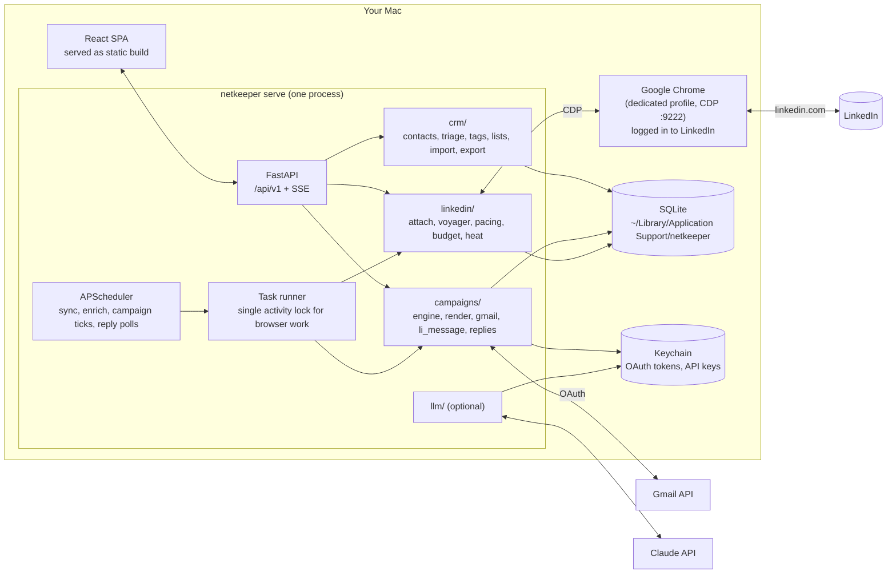
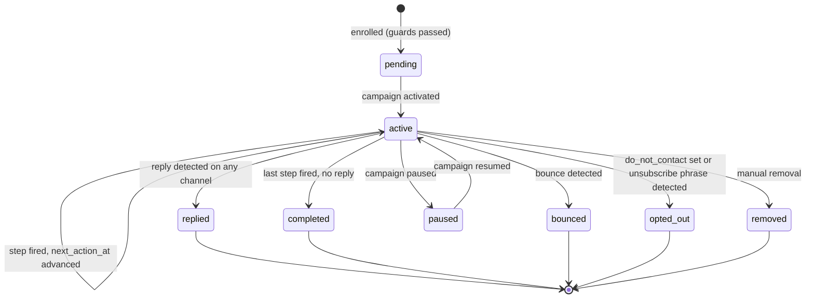

# netkeeper architecture spec

| | |
|---|---|
| Status | Draft v0.1 |
| Date | 2026-09-20 |
| Name | `netkeeper`, at [github.com/dsmorgan/netkeeper](https://github.com/dsmorgan/netkeeper) |
| Related | [networking-workflow.md](networking-workflow.md), the method this tool automates; [implementation-guide.md](implementation-guide.md), the backlog and checkpoints; [adr/](adr/), the reasoning behind contested decisions |

## 1. Summary

netkeeper is a local-first application that keeps your professional network warm. It automates the reconnect method in [networking-workflow.md](networking-workflow.md), which today takes a LinkedIn data export, a spreadsheet, a profile-scraping tool, and a bulk-mail tool. The method comes from hellophello's job-search networking program; that name is an acknowledgement, and it appears nowhere in the implementation. netkeeper does the whole thing in one tool with three parts:

1. **Extract.** Pull your 1st-degree LinkedIn connections and their contact info through a browser sidecar attached to the Chrome you already use, with human-like pacing and hard daily budgets.
2. **Organize.** Store, deduplicate, triage, tag, and segment those contacts in a local CRM with CSV import and export and periodic re-sync against LinkedIn.
3. **Reach out.** Run multi-step outreach sequences over Gmail and LinkedIn messaging, with draft, send, and prefill modes, automatic reply detection, and follow-up suppression.

It runs natively on macOS as one Python process (FastAPI plus a scheduler) that serves a React frontend on `127.0.0.1`. A container image exists for Linux hosts. The LinkedIn steps require Chrome running on the same machine.

v1 serves one person on one machine. The schema and service boundaries carry a user boundary from the first migration so that a self-hosted or hosted multi-user deployment is an addition later, not a rewrite. See [Multi-user readiness](#multi-user-readiness).

## 2. Goals and non-goals

### Goals

- Automate all five stages of the reference workflow end to end, so a weekly outreach cycle takes minutes of your attention, not hours.
- Never put your LinkedIn account at more risk than the profile-scraping tools the reference workflow already recommends. Default budgets are conservative and every protection is on by default.
- Keep all data on your machine. No hosted service, no telemetry.
- Make every automated action reviewable before it happens and traceable after it happens.
- Reuse the browser-sidecar patterns that igtracker proved against Instagram: CDP attach, in-page fetch, lognormal pacing, daily budgets, heat-based backoff, cooperative cancel, resumable runs.
- Keep a user boundary in the schema and the service layer from day one, so multi-user deployment later is an addition rather than a migration of every table.

### Non-goals for v1

- Login, hosting, or serving more than one person. v1 runs for one person, one LinkedIn account, one Gmail mailbox. The design still carries `user_id` everywhere (see [Multi-user readiness](#multi-user-readiness)); what is deferred is the operational work, not the data model.
- 2nd- and 3rd-degree connections, connection requests, InMail, or Sales Navigator. The extractor keeps a `degree` field so this can be added later, but v1 only reads people you are already connected to.
- Email open tracking. It needs a public pixel endpoint and hurts deliverability. Reply rate is the metric that matters in the reference workflow anyway.
- Cold outreach to people outside your network. The tool is built for reconnecting, and its guards assume that.
- A general-purpose CRM (deals, pipelines, companies as first-class objects).

## 3. Mapping to the reference workflow

The table shows each manual step in [networking-workflow.md](networking-workflow.md) and what netkeeper does instead. Stage numbers refer to that document.

| Workflow step | Manual today | netkeeper |
|---|---|---|
| 1.1 Export connections | Request the LinkedIn data archive, wait up to 24 h, unzip, open CSV | **Import** the official archive (zero-risk seed) and/or **Connections sync** through the sidecar (minutes, no wait) |
| 1.2 Mark people you have met | Add a column in a spreadsheet | **Triage** screen: keyboard-driven met / not met / skip, with evidence (message history, connected-on date, notes) |
| 1.3 Keep the validated list | Sort, delete rows, save a copy | `met` is an enum field (`unknown`, `met`, `not_met`, `skip`); nothing is deleted. A built-in smart list "Validated" holds `met = met` |
| 2 Enrich contact info | Paste URLs into a scraping tool, 100 at a time, clean the CSV | **Enrichment** job visits profiles under a daily budget, harvests email, phone, location, and current position in one visit, prioritized by who you plan to contact |
| 2 Keep the essential fields | Delete columns in a spreadsheet | Not needed. Export presets produce any column layout, including the nine-column layout in Appendix A |
| 3.1 Build a list of 100, drop no-email | Manual list | Static and smart **lists**; `has_email` is a filter |
| 3.2 Tag by role | The mailing tool tags by title on import | **Auto-tag rules** (regex on title and company), optional LLM classification |
| 3.3 Write the message | Template in the mailing tool | **Templates** with merge fields and lint |
| 3.4 Test send | Send to yourself | **Test send** is required before activation |
| 3.5 Have it reviewed | Ask a coach | **Review gate** with rendered previews of real contacts |
| 4 Folder for campaign replies | Create a mail folder by hand | Gmail **label** per campaign, applied to outbound and detected replies |
| 4 Track who responded | Notes and calendar reminders | **Reply detection** on Gmail threads and the LinkedIn inbox; interaction timeline per contact; follow-up reminders |
| 5.1 Remove responders from the follow-up list | Spreadsheet surgery | Automatic suppression when an enrollment reaches `replied` |
| 5.2 Follow up a week later, in the same conversation | A second campaign built by hand | **Sequences**: step 2 fires N days after step 1 unless a reply was detected, threaded under the first email |
| 5.3 Send Tuesday to Thursday | Remember to | **Send windows** and daily caps, with the next fire shown on the dashboard |
| 5 Weekly cadence, new batch or follow-up | Remember to | Dashboard shows what fired and what fires next; overlapping campaigns are supported |
| 5 Keep enriching 100 per day | Scraping tool batches | Enrichment runs on a schedule inside the budget; new connections arrive through incremental sync |

## 4. Requirements

### 4.1 Functional

**Extractor**

- F1. Attach to a running Chrome over the Chrome DevTools Protocol (CDP) and use the LinkedIn session already there. Never launch a second browser identity.
- F2. Enumerate all 1st-degree connections with name, public profile URL, stable profile URN, headline, and connected-on date. Support a full sync and a cheap incremental sync (newest first, stop at first known).
- F3. For a prioritized subset of contacts, visit the profile and harvest contact info (emails, phones, websites, social handles), location, and current positions in a single visit.
- F4. Pace every action with lognormal delays, human-like scrolling, active-hours windows, a warm-up ramp for new installs, and per-day and per-week budgets by action class.
- F5. Classify failures into throttled, checkpoint, logged out, not found, and endpoint changed; back off, stop, or skip accordingly. Never retry a checkpoint.
- F6. Record every run with counts, budget spend, browser mode, and notes. Runs are cancellable and resumable.
- F7. Detect changes between syncs: new connections, removed connections (debounced), and title, company, or location changes. Keep a history per contact.
- F8. Import LinkedIn's official data archive (`Connections.csv`, `messages.csv`) as a seed and as a triage signal.

**CRM**

- F9. Contacts with multiple emails and phones, a preferred first name for personalization, notes, tags, and an interaction timeline.
- F10. Triage workflow to mark contacts as met, not met, or skipped, with keyboard navigation and evidence panels.
- F11. Manual tags and rule-based auto-tags. Auto-tags never overwrite manual ones and are visibly distinct.
- F12. Static lists and smart lists (saved filters). A filter language that covers tags, fields, met status, last contacted, campaign membership, and data completeness.
- F13. CSV import with a column-mapping UI, saved presets (LinkedIn archive, LinkedHelper CSV, generic nine-column), duplicate detection with a review step, and provenance per imported field.
- F14. Export to CSV, JSON, and vCard with saved column presets, including the nine-column layout in Appendix A.
- F15. `do_not_contact` flag that every send path honors.

**Campaigns**

- F16. Templates per channel (email, LinkedIn) with Jinja merge fields for contact fields and your own profile (website, scheduling link, signature).
- F17. Campaigns are sequences of steps. Each step has a channel, a template, a delay from the previous step, a mode (`draft`, `send`, `prefill`, `auto_send`), and a condition (default: only if no reply yet).
- F18. Enrollment from a list or filter, with guards: no email or no LinkedIn URL for the channel, `do_not_contact`, already enrolled in an active campaign, contacted within the last N days, bounced address.
- F19. Review gate: a campaign cannot activate until you approve rendered previews of a sample and send a test to yourself.
- F20. Scheduler that fires due steps inside a send window, respects per-mailbox and per-campaign daily caps, and spaces sends with jitter.
- F21. Gmail integration through the Gmail API with OAuth: create drafts, send, thread follow-ups into the original conversation, apply a label per campaign, detect replies and bounces.
- F22. LinkedIn messaging: prefill the compose box in Chrome for you to send (default), or send automatically under a separate budget (opt-in).
- F23. Reply detection on both channels moves the enrollment to `replied`, stops remaining steps, and logs an inbound interaction.
- F24. Dashboard: what fired, what fires next, reply rate per campaign and step, budget spend, browser and mailbox health.

**Optional modules**

- F25. LLM assistance (off unless a key is configured): personalized opening line, title classification, profile summary for call prep, triage suggestions.
- F26. Push enriched contacts to Google Contacts (People API) and export vCards for macOS Contacts.

### 4.2 Non-functional

- N1. macOS 14+ is the primary platform. Linux via container is supported for everything; the LinkedIn steps need Chrome on the same host as the backend.
- N2. Chrome (or any Chromium browser) is the only supported browser for LinkedIn steps. Firefox and Safari have no CDP.
- N3. All data lives in one SQLite file plus a secrets store in the macOS Keychain. Backups are one command.
- N4. The web UI binds `127.0.0.1` only and needs no login in local mode, but state-changing API calls are protected against cross-site requests from other local pages.
- N8. Every user-owned row carries `user_id`, every query is scoped through one helper, and a two-user isolation test covers every list endpoint. Nothing in v1 needs this; retrofitting it is what would be expensive.
- N5. Tests run offline. Browser-touching code has an opt-in smoke suite against a loopback site.
- N6. Handles a network of 10,000 contacts with sub-second list and filter responses.
- N7. Every automated outbound message is stored with the exact rendered body, timestamp, and channel identifiers, so you can answer "what did I send this person and when" forever.

## 5. Architecture overview



### Process model

- One process: `netkeeper serve` starts FastAPI, mounts the built frontend, starts the scheduler, and owns the task runner. A launchd agent keeps it running.
- Chrome is started separately with a dedicated profile and a debug port (`netkeeper browser launch` wraps the command). You log in to LinkedIn in that profile once. netkeeper attaches and detaches; it never owns that browser.
- Browser work is serialized behind one activity lock. Gmail work and LLM calls are not browser work and run concurrently with it.
- Long-running work never executes inside a request handler. Routes enqueue a task and return; progress streams to the UI over Server-Sent Events (SSE).

### Patterns carried over from igtracker

These are the parts of `~/code/igtracker` that transfer directly, with the reason each one exists:

| Pattern | Why it matters here |
|---|---|
| `attach` browser mode over CDP, reuse `contexts[0]`, never close the context, never write cookies back, never override the UA | LinkedIn sees one device and one fingerprint. Your own browsing is cover traffic |
| In-page `fetch` of the site's internal JSON API from an authenticated tab | Stable data, far fewer page loads than DOM scraping, real cookies and client hints for free |
| Lognormal `human_delay` with a fat tail and occasional long "distraction" | A flat uniform distribution is itself a signature |
| Per-local-day budget enforced between units of work, never mid-unit | Stopping mid-list truncates data and poisons change detection |
| Heat score that rises per soft block and decays exponentially, computed on read | Stretches cooldowns and shrinks runs while the site is pushing back |
| Terminal-vs-retryable classification (`CheckpointRequired`, `LoginRequired`, `ThrottledOut`, `ProfileNotFound`, withdrawn route) | Retrying a checkpoint burns the account; retrying a dead route burns the budget |
| Active-hours window, deferred ticks, next fire time persisted across restarts | A schedule that resets on every deploy never fires |
| Single activity lock across every browser-touching path, including UI buttons | Two CDP clients on one browser drop each other's connection |
| Never `await` browser work inside a request handler | CDP attach blocks on the tab that is waiting for the response: a deadlock |
| Tab-loss recovery: reopen in the same context, at most one reattach per run | Closing the sidecar tab is a one-click accident |
| `rehearse` against a neutral site, `simulate` against a virtual clock, `preflight` on the real host | Verification without touching the real site |
| Posture page that highlights every protection that is off | A page that only displays values presents an unhardened install as configured |

### Multi-user readiness

netkeeper v1 runs for one person on one machine. A self-hosted deployment serving a household or a small team, or a hosted service, is a plausible future once the local form has matured. The constraints below apply from the first migration because retrofitting them later means touching every table, query, and job. Everything else about multi-user is deferred and listed at the end.

- **Users are a table, not an assumption.** A `user` row is created at first start (`kind = local`). Every user-owned table has a `user_id` foreign key, `NOT NULL`, indexed, and every uniqueness constraint includes it (`tag.name` is unique per user, `contact.li_urn` is unique per user).
- **Scoping happens in one place.** Routes resolve the current user through a `CurrentUser` dependency and pass it down. Services take `user` explicitly; the query helper applies `WHERE user_id = :id`. No route or service issues an unscoped query against a user-owned table. A two-user fixture in the test suite asserts isolation for every list endpoint.
- **Authentication is a provider interface.** `AuthProvider.current_user(request)` has one v1 implementation, `LocalSingleUser`, which returns the only row. A hosted deployment adds a session or OIDC provider without changing routes.
- **Per-user resources are rows.** `mailbox` and `linkedin_account` (section 8.4) belong to a user. `settings_kv` is keyed by `(user_id, key)`. Secrets are stored under `netkeeper/<user_id>/<name>`. Exports and backups live under a per-user subdirectory.
- **Concurrency is per account, not global.** The browser activity lock belongs to a `linkedin_account`. Scheduler jobs carry `user_id`. Budgets and heat are keyed by the LinkedIn account.
- **The extractor is a separable agent.** In a hosted deployment the browser sits on the user's laptop while the server is elsewhere, so the extractor must not depend on the database. It talks to the core only through explicit contracts: job specs in (`SyncJobSpec`, `EnrichJobSpec` carrying the contacts to visit and the budget), results out (`ConnectionsPage`, `ProfileHarvest`, `InboxDelta`), and a progress event stream. In v1 both sides run in one process, but no module under `linkedin/` imports ORM models or opens a session. A later `netkeeper agent` command can run the same jobs on a laptop and post results to a server. See section 9.10.
- **The database is portable.** SQLite in v1, but migrations use only constructs SQLAlchemy renders the same on PostgreSQL (portable types, `JSON` rather than text blobs, no SQLite pragmas in the schema). From phase 1, CI runs the migration test against a PostgreSQL service as well.
- **The frontend has a current-user context** from `GET /api/v1/me`, and component state holds mailboxes and LinkedIn accounts as lists, even when the list has one item.

Deferred until the local form has matured, and decided by a future ADR: login and session handling, sharing contacts across users, fairness of LinkedIn and Gmail budgets across tenants, a verified Google OAuth app, encryption at rest per tenant, an admin surface, and billing. Whether that future is self-hosted, hosted, or both is an open question (section 21).

## 6. Technology choices

| Layer | Choice | Rationale |
|---|---|---|
| Language | Python 3.12 | Matches igtracker; Playwright, SQLAlchemy, and the Google client libraries are mature here |
| Package manager | `uv` | Fast, lockfile, `uv run` for scripts |
| Browser driver | Playwright (Python) `connect_over_cdp` | No bundled browser needed in attach mode; any Chromium works |
| Database | SQLite via SQLAlchemy 2.0, Alembic migrations, WAL mode | Single file, zero ops, fast enough for 10k contacts. `UTCDateTime` decorator from igtracker |
| Web framework | FastAPI, Pydantic v2, `sse-starlette` | Typed API, OpenAPI for free, SSE for progress |
| Scheduler | APScheduler 3.x (asyncio) | Proven in igtracker including the restart-safe next-fire logic |
| Templating | Jinja2 sandboxed environment | Merge fields with filters, safe against template injection from imported data |
| Gmail | `google-api-python-client`, `google-auth-oauthlib` | Official; drafts, send, threads, labels, history |
| Secrets | `keyring` (macOS Keychain; file backend in container) | Refresh tokens and API keys never sit in the SQLite file |
| CLI | Typer | Same as igtracker; every UI action has a CLI equivalent |
| Frontend | Vite, React 19, TypeScript, TanStack Router + Query + Table, Tailwind, shadcn/ui, react-hook-form + zod | Rich tables and forms without a heavy framework; components are copied into the repo, not a dependency |
| API client | `openapi-typescript` + `openapi-fetch`, generated from FastAPI's schema in CI | Frontend types never drift from the backend |
| Frontend package manager | `pnpm` | Fast, strict |
| Lint and types | `ruff`, `mypy --strict` on new code, `eslint`, `tsc --noEmit` | |
| Tests | `pytest`, `pytest-asyncio`, `vitest`, Playwright for a handful of UI flows | |
| LLM | `anthropic` SDK; default model `claude-sonnet-5`, bulk classification on `claude-haiku-4-5-20251001` | Optional; model IDs live in config |
| Container | Multi-stage Dockerfile (Node build stage, Python runtime), compose file with `network_mode: host` | Linux hosts only for the LinkedIn steps; see section 16 |

## 7. Repository layout

```
netkeeper/
├── pyproject.toml            # package "netkeeper", console script "netkeeper"
├── uv.lock
├── config.example.toml
├── Dockerfile
├── docker-compose.yml
├── Makefile                  # dev, test, lint, build-ui, serve, backup
├── netkeeper/
│   ├── cli.py                # Typer app
│   ├── config.py             # TOML Settings dataclass, path resolution
│   ├── db.py                 # engine, session_scope()
│   ├── migrations.py         # run Alembic programmatically (db upgrade|current|revision)
│   ├── alembic.ini
│   ├── alembic/              # env.py, script.py.mako, versions/; shipped in the wheel
│   ├── paths.py              # data dir resolution per platform
│   ├── models/               # ORM: contacts.py, campaigns.py, runs.py, settings.py
│   ├── linkedin/
│   │   ├── browser.py        # CDP attach, tab management, activity lock, reattach
│   │   ├── voyager.py        # endpoint constants, header builder, in-page fetch, response parsers
│   │   ├── dom.py            # DOM fallbacks for connections list and contact-info overlay
│   │   ├── connections.py    # full + incremental sync, edge lifecycle
│   │   ├── enrich.py         # profile visit, harvest everything, snapshot diff
│   │   ├── inbox.py          # conversation polling for reply detection
│   │   ├── messaging.py      # prefill compose; opt-in auto send
│   │   ├── pacing.py         # human_delay, scroll_like_a_person, active hours (pure)
│   │   ├── budget.py         # per-day / per-week counters by action class
│   │   ├── heat.py           # adaptive backoff score
│   │   ├── classify.py       # response → Throttled | Checkpoint | LoggedOut | NotFound | RouteGone | Ok
│   │   └── archive.py        # LinkedIn data export (.zip / CSV) importer
│   ├── crm/
│   │   ├── contacts.py       # CRUD, identity resolution, merge
│   │   ├── triage.py
│   │   ├── tags.py           # manual + rule-based auto-tags
│   │   ├── lists.py          # static lists, smart-list filter DSL → SQL
│   │   ├── importer.py       # CSV mapping, presets, dedupe review
│   │   ├── exporter.py       # CSV / JSON / vCard, presets
│   │   └── timeline.py       # interactions
│   ├── campaigns/
│   │   ├── engine.py         # enrollment state machine, tick
│   │   ├── render.py         # Jinja sandbox, merge fields, lint
│   │   ├── gmail.py          # OAuth, drafts, send, threads, labels, history
│   │   ├── replies.py        # reply and bounce detection for both channels
│   │   ├── guards.py         # eligibility checks
│   │   └── windows.py        # send windows, caps, spacing
│   ├── llm/
│   │   ├── client.py
│   │   ├── personalize.py
│   │   ├── classify.py
│   │   └── summarize.py
│   ├── sync/
│   │   ├── google_contacts.py
│   │   └── vcard.py
│   ├── services/
│   │   ├── scheduler.py      # jobs, next-fire persistence, active hours
│   │   ├── tasks.py          # task runner, SSE event bus
│   │   ├── posture.py        # protection summary for Settings
│   │   ├── backup.py
│   │   ├── simulate.py       # virtual-clock schedule replay
│   │   └── rehearse.py       # drive the browser path against a neutral site
│   └── web/
│       ├── app.py            # factory, lifespan, static mount, CSRF guard
│       └── api/              # routers: contacts, tags, lists, triage, imports, exports,
│                             #   linkedin, templates, campaigns, mailboxes, settings, events, llm
├── frontend/
│   ├── package.json
│   ├── vite.config.ts        # dev proxy /api → 127.0.0.1:8000
│   └── src/
│       ├── api/              # generated client
│       ├── routes/           # TanStack Router file routes
│       ├── components/
│       └── features/         # contacts, triage, imports, linkedin, campaigns, settings
├── tests/
│   ├── fixtures/voyager/     # sanitized JSON captures
│   ├── fixtures/archive/     # sample Connections.csv, messages.csv
│   └── ...
├── scripts/
│   ├── install-launchd.sh
│   └── launch-chrome.sh
└── docs/
    ├── architecture.md       # this document
    ├── networking-workflow.md
    ├── implementation-guide.md
    └── adr/                  # architecture decision records; 0001–0005 exist
```

## 8. Data model

SQLite, one file. All datetimes stored as naive UTC and returned timezone-aware (igtracker's `UTCDateTime`). Soft deletes nowhere; contacts are archived, never deleted, because messages reference them.

**Every user-owned table below carries `user_id`** (FK to `user`, `NOT NULL`, indexed) and every unique constraint includes it. The column is omitted from the tables that follow to keep them readable. Tables that are not user-owned: `user`, `alembic_version`.

`user`

| Column | Notes |
|---|---|
| `id` | integer PK |
| `kind` | `local` in v1; later `hosted` |
| `display_name`, `email` | Used for `me.*` merge-field defaults |
| `timezone` | Default for send windows and active hours |
| `created_at` | |

`user_positions` (P1-26, #84): the user's own job history, the source for the you-and-them overlap on the triage card (10.2). One row per stint, shaped like `contact_position` below (`title`, `company`, `company_urn`, `started_on`, `ended_on`, `is_current`, plus `source`/`observed_at`) but hanging directly off `user_id`, because there is exactly one of these tables and it belongs to the person running netkeeper, not to anyone they know. Filled from the LinkedIn archive's `Positions.csv` and editable by hand through `/me/positions`; re-import matches an existing row by company and title case-folded plus the start date. **Manual edits win, permanently** — this is the one place a table shaped like a contact child table (source/observed_at, refreshed chronologically) is also fully user-editable, so it adopts P1-18's contract instead of the weaker one: once a row's `source` is `manual` (added by hand, or an archive-sourced row later edited), no import writes to it again at any date, only another edit or a delete. A row that has never been touched by hand keeps the ordinary chronological rule: an import refreshes it only when the new observation is at least as new as the one on file. There is no `synced_values`-style revert ledger for this table; a manual edit cannot currently be undone back to what the archive reported, unlike a `contacts` LinkedIn field. A manual edit that changes `company`, `title`, or `started_on` — the natural key itself — also moves the row out of the key a later import of the same archive would look for, so that import creates an additional row rather than finding the edited one; this is the same accepted limit of natural-key matching `contact_position` already has.

### 8.1 Contacts and identity

`contact`

| Column | Notes |
|---|---|
| `id` | integer PK |
| `li_urn` | `urn:li:fsd_profile/…`. Stable identity from LinkedIn. Nullable for rows that came only from a CSV |
| `li_public_id` | The `/in/{public_id}` slug. Changes when the person edits their vanity URL |
| `li_url` | Canonical `https://www.linkedin.com/in/{public_id}/` |
| `first_name`, `last_name` | As LinkedIn shows them |
| `preferred_name` | What you call them. Defaults to `first_name`; you fix "Robert" → "Bob" in triage. Templates use this |
| `headline`, `current_title`, `current_company`, `location` | Latest observed |
| `connected_on` | Date, from sync or archive |
| `degree` | 1 in v1 |
| `met` | enum `unknown`, `met`, `not_met`, `skip`; `triaged_at`; `met_source` (`manual` or `automatic`) says whether the person decided it or a triage batch they accepted did (10.2) |
| `do_not_contact` | boolean, with `do_not_contact_reason` |
| `li_missing_count`, `li_disconnected_at` | Debounced removal, see 9.8 |
| `last_enriched_at`, `enrich_priority` | Enrichment scheduling |
| `last_contacted_at` | Denormalized: the `at` of the newest outbound `interaction` (`email_out`, `li_out`, `call`, `meeting`), so the `last_contacted` filter and sort never scan the timeline. Maintained by the interaction service and the campaign engine, recomputed from the rows on edit or delete |
| `notes` | Markdown |
| `archived_at` | |
| `source` | `sync`, `archive`, `csv`, `manual` (first source; per-field provenance lives in `field_sources`, and each child row carries its own `source`) |
| `synced_values` | JSON, per LinkedIn field: the last value an automated source (`sync`, `archive`, `csv`) reported, with its source and `observed_at`, kept whether or not it reached the column. What a manual override reverts to (10.5) |
| `field_sources` | JSON, per LinkedIn field: the source that last wrote it, which decides who may overwrite it (10.5). `manual` here is an override until reverted |
| `created_at`, `updated_at` | |

Child tables, all `contact_id` FK with `source` and `observed_at`:

- `contact_email` (`email`, `kind` personal/work/other, `is_primary`, `status` ok/bounced/invalid)
- `contact_phone` (`number_e164`, `raw`, `kind`, `is_primary`)
- `contact_link` (`url`, `kind` website/twitter/github/other)
- `contact_position` (`title`, `company`, `company_urn`, `started_on`, `ended_on`, `is_current`)
- `contact_snapshot` (`headline`, `current_title`, `current_company`, `location`) written when any of those changes, so "changed jobs since last sync" is a query
- `interaction` (`kind` note/call/meeting/email_out/email_in/li_out/li_in/li_view, `at`, `summary`, `message_id` nullable)

### 8.2 Identity resolution

Every import or sync resolves each incoming row to a contact by, in order:

1. `li_urn` exact match.
2. `li_public_id` exact match (case-insensitive). If the incoming row also carries a URN, store it.
3. Any email exact match (lowercased).
4. `first_name` + `last_name` + `current_company` exact match → **candidate**, not a match. Candidates go to the import review screen.
5. Otherwise, new contact.

A `contact_alias` table records old `li_public_id` values so a renamed vanity URL still resolves.

Merging two contacts is a first-class operation that re-points every child row and message and records `merged_into_id` on the loser.

**What "every child row" includes, as built (P1-27).** `list_members` is one of them: the survivor stays in every static list the loser was in, and where both were in a list, the survivor's own membership row is the one kept, with the `added_at` the person joined by. The table is not a child of `contacts` in the way the others are — a membership row belongs to a list and names a contact — which is exactly how it was missed until #81.

### 8.3 Organization

- `tag` (`name` unique, `color`, `kind` manual/auto/llm, `met_signal` nullable `met`/`not_met`: what the user says carrying the tag means for triage, 10.2), `contact_tag` (`contact_id`, `tag_id`, `source`, `rule_id` nullable). Unique on (`contact_id`, `tag_id`). Removing an auto-tag manually writes a `contact_tag_suppression` row so the rule does not re-add it.
- `autotag_rule` (`tag_id`, `field` title/headline/company, `pattern` regex, `enabled`, `order`).
- `list` (`name`, `kind` static/smart, `filter_json` for smart), `list_member` (`list_id`, `contact_id`, `added_at`) for static.
- `saved_view` (table column and sort presets for the Contacts page).

### 8.4 Extraction and import runs

- `sync_run` (`kind` connections_full/connections_incremental/enrich/inbox/message_send, `status` running/completed/aborted/failed, `started_at`, `completed_at`, `progress_json`, `counts_json`, `browser_mode`, `notes`, `resume_of_id`).
- `import_run` (`source_kind` archive/csv, `filename`, `preset`, `mapping_json`, `status`, counts, including what the auto-tag rules did when it committed: `tagged_contacts`, `tags_added`, `tags_removed`) and `import_row` (`raw_json`, `resolution` matched/created/candidate/skipped, `contact_id`, `decision_json`).
- `linkedin_account` (`user_id`, `label`, `cdp_url`, `timezone`, `active_hours_json`, `session_status` ok/checkpoint/logged_out, `session_flag_at`). One row in v1. Budget counters and heat state are keyed by this row's id in `settings_kv`, and the browser activity lock belongs to it.
- `settings_kv` (`user_id`, string key, JSON value) for runtime-adjustable settings, budget counters, heat state, next-fire times, session flags.

### 8.5 Campaigns

- `mailbox` (`email`, `provider` gmail, `keychain_ref`, `daily_cap`, `status` ok/reauth_required/disabled, `label_prefix`). One row in v1.
- `template` (`name`, `channel` email/linkedin, `subject` nullable, `body`, `lint_json`, `updated_at`). Versioned: editing a template used by an active campaign creates a new row and the campaign keeps pointing at the old one until you choose to upgrade.
- `campaign` (`name`, `status` draft/reviewing/active/paused/completed/archived, `source_list_id` or `filter_json`, `mailbox_id`, `send_window_json`, `daily_cap`, `contacted_within_days_guard`, `approved_at`, `test_sent_at`).
- `campaign_step` (`campaign_id`, `position`, `channel`, `template_id`, `delay_days`, `mode` draft/send/prefill/auto_send, `condition` no_reply/always, `same_thread` boolean).
- `enrollment` (`campaign_id`, `contact_id`, `status`, `current_step`, `next_action_at`, `exit_reason`, `replied_at`, `channel_ids_json`). Unique on (`campaign_id`, `contact_id`).
- `message` (`enrollment_id`, `step_id`, `contact_id`, `channel`, `direction` out/in, `status`, `subject`, `body_rendered`, `scheduled_at`, `sent_at`, `gmail_message_id`, `gmail_thread_id`, `gmail_draft_id`, `li_conversation_urn`, `li_message_urn`, `error`).

## 9. LinkedIn extractor

### 9.1 Browser attach

The extractor only supports `attach` mode. igtracker's `legacy` and `persistent` modes exist because Instagram sessions could be pasted; here they would create a second LinkedIn device, which is the main restriction trigger. The `BrowserProvider` interface is kept so a mode can be added later, but `attach_fallback` does not exist: if Chrome is not reachable, the run fails loudly and the scheduler retries later.

Chrome setup, wrapped by `netkeeper browser launch`:

```sh
open -na "Google Chrome" --args \
  --remote-debugging-port=9222 \
  --user-data-dir="$HOME/Library/Application Support/netkeeper/chrome-profile"
```

Chrome 136 and later refuse `--remote-debugging-port` on the default profile directory, so a dedicated profile is mandatory. You log in to LinkedIn in that profile once. LinkedIn sees one new device at setup and then a stable one. Use that profile for your own LinkedIn browsing too, so organic activity and sidecar activity share a session.

Invariants inherited from igtracker: reuse `browser.contexts[0]`; open one tab per run and close only that tab; never `add_init_script` or `route` on the shared context; never write cookies; never override the UA or timezone. `netkeeper preflight` verifies the attach, that the tab is logged in, and that the profile's fingerprint looks like a normal Chrome.

### 9.2 Data sources, layered

| Source | Cost | What it gives | Role |
|---|---|---|---|
| LinkedIn data archive (`Connections.csv`, `messages.csv`, `Invitations.csv`) | Zero risk, 24 h wait | Name, URL, company, position, connected-on for everyone; email only for people who opted in; full message history | Seed and triage evidence. The importer skips the three-line preamble LinkedIn puts above the header |
| Connections list (in-page API, DOM fallback) | Cheap: about 40 contacts per request | URN, public id, name, headline, picture, connected-on | Sync, change detection |
| Profile visit | Expensive: this is what LinkedIn rate-limits | Contact info overlay (emails, phones, websites, handles), location, positions, education | Enrichment. One visit harvests everything |
| Messaging conversations (in-page API) | Cheap | Threads, participants, last message, direction | Reply detection for LinkedIn steps; "have we talked" triage signal |

### 9.3 In-page API first, DOM second

LinkedIn's web client talks to an internal REST API under `/voyager/api/`. From a tab on `linkedin.com`, a `fetch` carries the session cookies and Chrome's real client hints. The request needs the `csrf-token` header (the `JSESSIONID` cookie value without its quotes) and `x-restli-protocol-version: 2.0.0`, plus the `accept` and `x-li-*` headers the real client sends.

Endpoint paths, query shapes, and the `decorationId` values are undocumented and change. They live in one module, `linkedin/voyager.py`, each constant annotated with its capture date, and every parser is tested against sanitized fixtures captured from DevTools. When a request answers with a shape the parser does not recognize, the run records `RouteChanged` and gives up on that endpoint for the run rather than retrying (igtracker's withdrawn-route lesson).

`linkedin/dom.py` holds the fallback for the two paths that matter most, the connections page infinite scroll and the contact-info overlay, so a Voyager change degrades the tool rather than stopping it.

### 9.4 Jobs

All jobs take the activity lock, hold one tab, and write progress to `sync_run.progress_json` for the SSE stream.

**Connections full sync.** Paginate the connections list to the end. Apply the edge lifecycle in 9.8. Runs on first setup and weekly.

**Connections incremental sync.** Newest-first pages; stop after a full page of already-known URNs. Runs daily. Cheap enough that it is the default keep-fresh mechanism.

**Enrichment.** Pick contacts by priority (9.6), and for each:

1. Navigate to the profile page (a real page view; the reference workflow treats "viewed your profile" as a feature).
2. Scroll like a person (9.5), dwell.
3. Fetch contact info and profile details through the in-page API, falling back to the overlay DOM.
4. Upsert emails, phones, links, positions, location. Write a snapshot if headline, title, company, or location changed.
5. Pause with `human_delay` before the next profile.

**Inbox poll.** Fetch recent conversations, match participants to contacts by URN, and hand new inbound messages to `campaigns/replies.py`. Runs every few hours while any LinkedIn step is active.

**Message prefill / auto-send.** See 11.6.

### 9.5 Human-like behavior

`linkedin/pacing.py` is pure and unit-tested:

- `human_delay(median, sigma, tail_p, tail_range)`: lognormal with a fat tail and an occasional long distraction. Defaults in Appendix C.
- `scroll_like_a_person(page)`: a sequence of `mouse.wheel` deltas with variable magnitude, brief pauses, an occasional scroll back up, and a final dwell. Total scroll depth is random and sometimes short.
- Bursts: 8 to 15 profiles, then a break of 5 to 20 minutes.
- Active hours: a window in your local timezone (default 08:30 to 21:30, all days). Ticks outside it park a one-shot job for the window start.
- Warm-up: a fresh install starts at 20 profile visits per day and grows by 10 per day up to the configured cap.
- Weekend and holiday damping: multiply budgets by 0.5 on Saturday and Sunday by default.
- Never run enrichment and a message send in the same minute; the scheduler interleaves job kinds with a gap.

### 9.6 Budgets and prioritization

Counters live in `settings_kv`, keyed by local day and week, per action class:

| Class | Default per day | Hard max | Notes |
|---|---|---|---|
| `connection_pages` | 150 | 400 | About 6,000 contacts per day at 40 per page |
| `profile_visits` | 60 | 100 | The number that matters. The reference workflow's guidance for scraping tools is 100 |
| `contact_info_fetches` | tied to `profile_visits` | | One per visit |
| `inbox_polls` | 8 | 24 | |
| `li_messages_auto` | 15 | 30 | Only when auto-send is enabled |
| `profile_visits` per week | 300 | 500 | |

Enrichment order: contacts you are about to enroll in a campaign that lack the channel's address, then `met` contacts never enriched, then stale (`last_enriched_at` older than 180 days), then everyone else, newest connection first. You can pin up to 5 contacts to the front of the next run (igtracker's pins, same rules: selected within the budget, not on top of it).

### 9.7 Failure classification and heat

`linkedin/classify.py` maps a response to one outcome:

| Signal | Outcome | Action |
|---|---|---|
| HTTP 200 JSON | `Ok` | |
| HTTP 429, or HTTP 999 | `Throttled` | Escalating cooldown, raise heat, at most 3 attempts; two consecutive throttled units abort the run |
| Redirect or body pointing at `/checkpoint/` or `/challenge/` | `Checkpoint` | Stop the run, set the session flag, banner in the UI. Never retry |
| Redirect to `/login`, `/authwall`, `/uas/`, or a body pointing at one of them, or 401 | `LoggedOut` | Stop, set the session flag, banner says log in to the netkeeper Chrome profile |
| HTTP 404 on a profile | `NotFound` | Terminal for the contact this run; increments a not-found streak used by 9.8 |
| HTTP 200 with an unrecognized shape, or 400 on a known endpoint | `RouteChanged` | Give up on that endpoint for the run, log loudly, fall back to DOM if one exists |

Heat (`linkedin/heat.py`): each `Throttled` or `Checkpoint` adds to a score that decays exponentially, computed on read. While warm, `human_delay` medians stretch and the per-run budget shrinks, never to zero. Above `heat_skip_threshold` the scheduler skips browser jobs entirely. The Settings page shows the level, when it was last raised, and when runs resume. A manual clear exists for the case where the block was something else.

### 9.8 Sync semantics and change detection

Unlike Instagram's follower lists, LinkedIn's connections list is complete, so removal detection is simpler but still debounced:

- A contact seen in a full sync gets `li_missing_count = 0`.
- A contact absent from a full sync gets `li_missing_count += 1`; at 2 consecutive misses `li_disconnected_at` is set. Incremental syncs never age anyone.
- A contact that reappears clears both. Nothing is deleted.
- Position and headline changes write a `contact_snapshot`. The dashboard surfaces "changed jobs in the last 30 days" as an outreach prompt; that is the single best reason to reconnect.
- A `NotFound` streak of 3 across at least 14 days marks the profile as gone (`li_disconnected_at` plus a note). Same two-threshold reasoning as igtracker: a deactivated profile looks exactly like a deleted one and often comes back.

### 9.9 Locking, cancel, resume, tab loss

- One `asyncio.Lock` for all browser paths, including the Settings page's "check session" button. A route that cannot take the lock answers `busy`.
- Cancel is cooperative: a flag in `settings_kv` checked between profiles and inside sliced cooldowns; the run ends `aborted` and whatever completed is kept.
- Resume: an aborted enrichment run stores its plan; `netkeeper linkedin enrich --resume <run_id>` skips what completed. The original plan is reused, never re-planned.
- Tab loss: `_ensure_page()` before every navigation; reopen in the same context at the last profile URL; at most one full reattach per run, then `BrowserUnavailable` aborts the run and the scheduler parks a retry 20 to 50 minutes out.

### 9.10 Boundary with the core

Nothing under `linkedin/` imports ORM models or opens a database session. The core hands a job a spec and receives results and events:

| Direction | Type | Contents |
|---|---|---|
| In | `SyncJobSpec` | mode full/incremental, known URNs (incremental only), page budget |
| In | `EnrichJobSpec` | ordered list of `(contact_ref, li_public_id)` to visit, visit budget, pacing profile, heat multiplier |
| In | `InboxJobSpec` | conversations since timestamp |
| In | `MessageJobSpec` | recipient, rendered body, mode prefill/auto_send |
| Out | `ConnectionsPage`, `ProfileHarvest`, `InboxDelta`, `MessageOutcome` | Plain dataclasses; the core's `crm/apply.py` maps them onto contacts, snapshots, and messages inside a session |
| Out | `ProgressEvent` | For `sync_run.progress_json` and the SSE stream |

The reason is in [Multi-user readiness](#multi-user-readiness): in a hosted deployment the browser and the database are on different machines. Keeping the boundary explicit now costs one mapping module and buys a `netkeeper agent` later. It also makes the extractor testable with fixtures and no database.

## 10. CRM

### 10.1 Contacts page

A dense table with server-side filtering, sorting, and pagination. Columns are configurable and saved as views. Row actions: tag, add to list, set met, set do-not-contact, pin for enrichment, open on LinkedIn, open in Gmail. Bulk actions apply to the current filter, with a confirmation that states the count.

`GET /contacts/stats` (`netkeeper contacts stats`) gives a dashboard the same counts and triage progress the triage queue's progress bar shows, from the one function, `contact_stats()`, both share (#90; before this item the CLI and the API computed the triage numbers separately and disagreed, #85).

### 10.2 Triage

The Step 6 replacement. A focused screen that shows one contact at a time:

- Name, headline, company, location, connected-on, profile photo.
- Evidence panel: LinkedIn message history (from the archive or the inbox poll), prior interactions, shared companies from positions, the you-and-them overlap from the user's own career, notes.
- Keys: `m` met, `n` not met, `s` skip, `u` undo, `t` tag, `p` edit preferred name, `→` next, `←` back, `?` the map itself.
- The same actions as buttons, each printing its key, so the map is learned by using the screen rather than by reading it.
- Position on the card: which contact of the run this is, and how much of the queue is left.
- The queue itself: the contacts already passed with the decision each carries, the one on screen, and the rest of the queue in the order it will be served. Any of the passed can be opened.
- Progress: triaged / total, with a filter to revisit `skip`.
- Bulk suggestion: "You have message threads with 143 untriaged people. Mark them all met?" Applied with one click, reversible.

**Triage starts from what is already decided (P1-22).** An imported archive is six hundred cold cards, and asking six hundred questions by hand is the thing this screen exists to avoid. So the import tags what it can (10.3), and triage opens on the work already done rather than on the first stranger:

- **A catalogue of batches, strongest evidence first, every one of them arguing from something on file.** `met_with_messages` (you and they wrote to each other); `met_invitation_note` (an invitation carried a personal note one way or the other, and no thread followed); and one batch per tag the user has given a meaning (`tags.met_signal` is `met` or `not_met`, and a tag with no meaning offers nothing). A batch matching nobody is not offered. Counts are taken against the queue as it stands, so accepting one shrinks the others, and where two batches would disagree about a person, whichever is accepted first decides them.
- **Nothing is decided from an absence (#142).** Triage is an affirmative pass — the method says *mark the people you have met*, and not-met is the residue rather than a judgement anybody makes — so having no message history on file is not evidence of never having met someone. There was a `not_met_no_evidence` batch here until CP2.5's first real run; it is gone, along with the clauses that existed only to hold people back from it. A tag batch may still decide `not_met`, because that is the user's own declared rule about their own label rather than an inference netkeeper drew, and `n` still decides one contact not met by hand. `TriageDecisionKind.BULK_NOT_MET` stays, and undo still takes back a `not_met_no_evidence` batch already on disk: undo walks `triage_decisions` by `batch_id` and restores `before_state`, so it never looks a suggestion key up in the catalogue.
- **Nothing applies itself.** A batch is a count, and `GET /triage/suggestions/{key}/contacts` is the list of names behind it, before anything is written. The apply carries the count the banner showed and refuses with `409` when the set has moved since.
- **Every automatic decision says so.** A batch writes `contacts.met_source = automatic` beside `met`, and one `triage_decisions` row per contact carrying the batch id and the key of the suggestion (`reason`). So the log answers "what did netkeeper decide for me, when, and why", a decision netkeeper made is never mistaken for one made by hand, and one undo takes the whole batch back to exactly where each contact was.
- **A review pass, not a cold start.** `GET /triage/next?decided_by=automatic` serves those contacts back on the same cards with the same keys, so the manual pass checks what was decided. Deciding one by hand makes it `manual`, which is how it leaves that queue; undo puts it back. `progress.automatic` is how many are waiting.

An invitation is stored as an `li_in`/`li_out` interaction like a message, distinguished only by the marker its summary starts with, so the message batch excludes them: clicking Connect is not a conversation. Against the reference archive that is 171 people rather than 178.

**What the screen does with it, as built (P1-28).** A line above the card says how many contacts netkeeper decided and offers the queue that walks them, which is a fourth filter beside Untriaged, Skipped and Both; in it, the same line says what this queue is and that answering a contact yourself is what takes it out. No batch is offered there, because a batch only ever reaches contacts nobody has answered for and asking for one over `met` is a `422`. Each offered batch has its own verb — a batch that decides `not_met` says so on its button — and a **See who** control lists the first ten names behind it with a count of the rest, because "which 171?" has no answer anywhere else on the screen. The list ahead is exact in the review pass too: `met_source` is a filterable field, so the same column `decided_by` narrows on is the one `POST /contacts/query` reads, and the panel shows the contacts this queue will actually serve rather than an approximation. That also makes "what did netkeeper decide for me" a question the contacts table answers, not only triage.

**The card is three steps, in the order you work them (CP2.5, #142).** The met/not-met call is the point of the screen and the *last* thing to do on a card, because fixing the name and putting the tags on is what you notice while you are looking at the person. So the card reads top to bottom: **(1) Name**, with the preferred name and an editor that opens in place; **(2) Tags**, with the tags already on and a picker that opens in place; then **(3) Have you met *them*?**, which is the loudest thing on the card. The name editor and the tag picker are sections of the card rather than overlays under it, and step 3 is the **only** place the three answers are offered: the button row above the card leads with Name and Tag and carries no decision at all, because a copy of Met/Not met/Skip up there would put the met call above the very things this order exists to put first, and two rows of the same three buttons are two answers to "where do I decide?". With no card on screen there is nothing to decide about — the empty queue offers what does make sense there, and a stray `m` still says "no contact is on screen yet" rather than doing nothing silently. The `?` overlay reads the whole key map, so it still teaches all nine keys whichever row draws their button. **No key changes**: `m`, `n`, `s`, `t`, and `p` all still fire from anywhere on the screen, so a trained run costs exactly what it cost before and only the reading order moved. Each decision carries its own one-line definition, and a collapsible explainer above the card says what the screen is for in the method's own words ([networking-workflow.md](networking-workflow.md#stage-1-validate-your-network), stage 1): met is anyone you have spoken with in person, on a video call, or in a real conversation, once counts, and seniority, usefulness, and how long ago it was are all beside the point. Its goal line is always on screen; the three definitions are folded behind a toggle and stay open once opened, per browser. **The decision row has to be reachable without scrolling**, and that is what decides the rest of the layout: at 1280x800, including the shell's top bar and with a bulk banner showing, the whole row sits at y=703-735 of an 800px viewport. Three things keep it there and are worth not undoing — the explainer's definitions start folded (they cost 116px open), the notice band sits *below* the card rather than above it, and the card and its steps share one bordered box rather than two. A fourth keeps it *still*: the headline is clamped to two lines with two lines always reserved, because it is the one part of the card whose height follows the contact, and without that a wrapped headline moved the buttons 40px down on that card alone — so the mouse had to re-aim on every contact. jsdom has no layout, so the suite holds the structure and the number is measured in a real browser.

**Liveness is on the card, not inferred (#91).** `TriageContactOut` carries `archived_at` and `merged_into_id`. The queue is `met IN states AND archived_at IS NULL AND merged_into_id IS NULL`, so those two fields are the whole difference between a restored contact that is back in the queue and one that is not. `TriageUndoOut.forced` never meant that — it lists every contact whose divergence a force overrode, an ordinary field edit included — so a client that read it as certainty put a notice about a contact that had left the queue in front of one that had not.

**Going back is not undo, as built (P1-23).** The CP2 walkthrough asked for both and they are two different things, so the screen keeps them apart by name and by effect. `←` is a **cursor over this run**: the client keeps every card that has left the front of the queue — whole, evidence included, up to the last hundred — with the decision it carries, and `←` walks it. Stepping back sends no request, writes nothing, and leaves the undo stack exactly where it was; the card says which decision the contact already holds and that coming there changed nothing. Deciding from there is an ordinary write on that contact, which the service records as another decision row, so undo still walks back one at a time; the cursor then steps forward, so `← m` returns you to where you were. `u` is the other thing: it asks the server to take back the newest **write**, whatever card is on screen — the stack is server-side, so on a fresh page it can reach a decision from an earlier session, and the line under the buttons says what it will take back. Every move of either kind says what just happened in one live line, which is what stops the two from being confused.

**Where the contacts ahead come from.** There is no triage endpoint that lists the queue — `GET /triage/next` serves one card and its successor — but the queue is not a private ordering, so the list does not have to be guessed at. `netkeeper.crm.triage._queue_where` is `met IN states AND archived_at IS NULL AND merged_into_id IS NULL`, ordered by `id`, and `POST /contacts/query` compiles to exactly that: `met` is a filterable enum field, `compile_where` adds `merged_into_id IS NULL` unconditionally and `archived_at IS NULL` unless `include_archived`, and `apply_sort` ends every ordering with `id ASC`, so an empty `sort` *is* the queue's order. The screen takes a hundred-row page at load and asks for another only when the tail it left runs short, which costs about seven reads across a six-hundred-person run. A contact further down that list cannot be opened: reaching them means passing everybody in between, which is a decision about thirty people rather than a navigation.

Two limits are worth naming. The trail is the client's own memory of the run: a reload starts a new one, and it keeps the last hundred cards — the position counter is the run's own and does not stop there. And a decision whose write is refused leaves the contact in the trail, marked, so `←` reaches them for another go; nothing was lost server-side either way, and the banner says so.

**Two company signals on the card, and they are not the same claim.** The evidence panel carries both, under different names, because having met someone is a separate dimension from having overlapped at an employer — someone can work at a large company alongside a connection for years without ever meeting them, and can also know someone they never worked with at all (CP2 decision).

- **`shared_companies`, as built (P1-09, #84).** Overlap with **the rest of your address book**, not with you: for each company the contact is at now or has been at, how many other live contacts are at that company and how many of those you have already marked met ("you know four people there, three of whom you have met"). Real triage evidence on its own, but not the LinkedIn "you both worked at X" signal the name suggests, and a UI must not label it that way. Two asymmetries follow from how it is counted: the contact's side uses `current_company` plus every one of their positions, while the other contacts are matched on `current_company` only, so somebody who was there with them and has since moved on is not counted; and a company with no overlap is still returned, with `contact_count: 0`, so a contact with ten past employers yields eleven entries and the client filters the empty ones. Unchanged by P1-26: this field, its name, and its behavior stay exactly as they were.
- **`worked_together`, as built (P1-26, #84).** The actual "you both worked at X" signal, now that `user_positions` (8) gives netkeeper a source for the user's own career: computed from the user's positions against this contact's own positions and current company, matched on company name loosely — case, punctuation, and one trailing legal-entity suffix folded away, so "Acme, Inc." and "Acme Inc" count as the same company — because neither source spells a company the same way twice. A match is only reported when the two sides are not *provably* disjoint (a stint known to have ended before the other started is excluded). Every entry carries `confirmed`: years (`started_on`/`ended_on`, the later of the two starts and the earlier of the two ends) are only ever populated from a pairing where **both** sides carry an actual date, never borrowed from whichever side happens to have one. In practice, until something other than the archive importer gives a contact dated positions, the contact's side is usually only a bare `current_company` with no date at all — real evidence a match is possible, since it can never be disproven, but no evidence of *when* — so most matches today come back `confirmed: false` with both dates `null`: "you were both at this company at some point," not a claimed range. An earlier draft of this field computed a range from the user's own dates in exactly that undated case; that was a fabrication (a contact who joined years after the user left would have come back as having overlapped during the user's tenure) and the pre-merge review of #127 caught it before merge.

### 10.3 Tags and auto-tag rules

Manual tags are yours. Auto-tag rules run on every contact create and every enrichment, and on demand. **As built (P1-22, #64):** an import runs them itself, over the contacts it created or enriched and no others, inside the same transaction — so an address book is tagged the moment it lands and a failed import takes its tags with it. The counts are in the archive import's report and on the `import_runs` row (`tagged_contacts`, `tags_added`, `tags_removed`). A contact created by hand, or through the extractor's sync, still waits for a run.

A tag can also carry `met_signal`: the user's own reading of their own label, `met` or `not_met`, which puts a triage batch on offer (10.2). It is the only thing that turns a tag into a decision, and it never does so by itself — the batch is previewed and accepted like any other. Default rules ship for c-suite, vp, director, founder, investor, recruiter, engineering, product, design, sales, marketing, consultant, and academic. Rules are editable in the UI with a live "matches 214 contacts" preview. An auto-tag you remove is suppressed for that contact; a manual tag is never touched by rules. LLM tags (section 12) are a third kind with the same suppression behavior.

### 10.4 Lists and the filter language

Smart lists store a filter tree serialized as JSON and compiled to SQLAlchemy. Supported predicates: field comparisons, tag any/all/none, `met`, `has_email`, `has_phone`, `has_li_url`, `last_contacted before/after`, `enrolled_in`, `replied_in`, `changed_jobs_within`, `connected_on` ranges, `list_member`. The same filter powers the Contacts table, campaign enrollment, and exports, so "the people who get this campaign" is always a visible, re-runnable definition.

Static lists are explicit membership with an `added_at`, for the "First 100" style batches in the training.

**Choosing the list, as built (P1-28).** The builder has a picker over `GET /lists`, so `list_member` is an ordinary predicate rather than a grey row with an explanation. `list_id: 0` is what the palette creates and no list has that id, so a row left alone selects nobody rather than quietly selecting whichever list is first; a saved filter naming a list that has since gone keeps the id and says so, because dropping it would change what the filter means. The same predicate is what a static list's **Export** sends — the button that was withheld while the compiler refused `list_member`, since the only filter the screen could have sent was "everyone".

**How `list_member` compiles, as built (P1-27).** A static list becomes a correlated `EXISTS` over `list_members` for that id, which needs nothing but the id. A smart list is its stored tree, inlined into the filter being compiled — so a list defined in terms of another list is one flat statement, not a query per contact and not a materialized set. Three rules follow from making the predicate mean what the list page means:

- **Liveness.** A static list's members are live contacts: archived or merged away, they are not members, whatever `include_archived` says on the filter around them, because a membership row outlives either. A smart list's own `include_archived` decides its membership, and the outer filter still applies its own on top. So `list_member` selects the list's members and the surrounding tree then rules on them like any other predicate: the two readings agree for every list whose membership excludes archived contacts, and a smart list that sets `include_archived` itself is the one case where its page can show someone that a filter around it, at the default, will not return.
- **Cycles.** Two lists could otherwise define each other. The compiler carries the ids it is already standing in for and refuses a reference back to one. A cap on how many lists one filter may pull in (32) bounds the other blowup, a chain of lists each naming the one below it twice.
- **A reference to a list that is not there** — deleted, or another user's — matches no contact, the way a tag name nobody has used does. Turning it into an error would mean deleting one list could 422 every page that reads another.

**Which leaves the writes, which is where the danger actually is.** A filter that compiles is not the same as a filter that is safe to store, because storing one can break a *different* list. Three guards, all in `netkeeper.crm.lists`:

1. A `list_member` naming a list the user does not have is refused **at write time**, even though compiling one is deliberately lenient. Ids are handed out in order, so the id a new list is about to be given does not exist while its own filter is being validated: a forward reference was accepted and then handed that very row, which closed a cycle in two ordinary `POST`s.
2. `update_list` tells the compiler which list it is about to become, so a tree that reaches back to its own list is refused at the write that would close the cycle.
3. Every list write compiles the user's smart lists before and after itself and refuses to be the change that broke one. The first two guards look *down* from the tree being stored and cannot see the lists that name it: one at the expansion cap is broken by an edit one link below it, whose own save costs a single inline and passes. Comparing against what was already broken, rather than against "nothing is broken", keeps a list that is already unreadable from blocking the edit that would fix it.

And should a broken list exist anyway — data edited around the API — `GET /lists` marks that one list `broken` with the reason instead of failing: it is the page someone would use to find and delete it, so one bad list may not hide the rest. Asking about that list by id still answers 422.

Ids are not reused by a sequence but are by SQLite, so a reference whose list was deleted can come to name a later list with that id. The guards above refuse the version of that which breaks something; deleting a list logs the lists that named it, so the version that does not break anything is at least visible.

Because a smart list's tree lives in the `lists` table, compiling a filter is no longer a pure function of the tree: it takes a session. It reads nothing for a filter with no `list_member` in it, and one indexed row per distinct list id for one that has, at compile time rather than per contact.

### 10.5 Import

1. Upload a CSV or the LinkedIn archive zip.
2. Pick a preset or map columns by hand; mapping is saved as a new preset.
3. Preview: the first 20 rows resolved (matched, created, candidate), counts for the whole file.
4. Resolve candidates one by one or accept all creates.
5. Commit inside one transaction. `import_row` keeps the raw row and the decision, so any import can be audited or rolled back by run.

A file that is only inspected or previewed writes nothing, but step 3's draft is a real row: reading a file, or a commit refused for undecided candidates, leaves an `import_run` in `draft` status and its rows behind. `GET /imports?status=draft` (`netkeeper import runs --status draft`) finds these; `DELETE /imports/{id}` (`netkeeper import rm`) removes one; and a refused commit is finished, not re-read, with `POST /imports/{id}/commit` on the same id (`netkeeper import resume`) — the same run the web wizard's "Finish this import" resumes (#90).

Field-level provenance: an imported value never overwrites a value from a more authoritative source. For a LinkedIn field a manual edit sticks: once you edit it, no later sync, archive, or CSV import overwrites it until you revert it (CP1 decision, #28). Clearing a field by hand is an edit too and sticks the same way. The last value each automated source reported is kept per field in `contacts.synced_values` (value, source, `observed_at`), whether or not it reached the live column, so a revert restores LinkedIn's value and its provenance. Among the automated sources, sync > archive > csv. For `preferred_name`, `notes`, `met`, and tags, manual wins and no import touches them. `met` carries `met_source` beside it, saying whether the person decided it or a triage batch they accepted did (10.2); no import writes either.

The archive zip's upload does not go through steps 2-5 above: `POST /imports/archive` (P1-20) reads it straight from the upload FastAPI already received and runs it through the LinkedIn archive importer (spec 9.2; `crm/archive.py`) in the request's own transaction, answering per-table counts. There is no mapping, preview, or candidate-review step for it, because that pipeline has none — a connection row that resolves to a candidate is counted and left for a later CSV import to resolve instead (see that module's docstring). The CLI's `netkeeper import archive` runs the same importer on a path (a zip, a directory, or one CSV) and reports the same counts for the same archive.

**The wizard's two shapes (P1-21).** Dropping or choosing a file routes it one of two ways, and the screen says which before anything is sent. A `.zip`, or a lone `messages.csv` or `Invitations.csv`, goes to `POST /imports/archive` above: a short "recognize, then import" screen with an explicit Import button — nothing is sent on drop alone — followed by a result screen with each table's own counts (so a headline number like "616 contacts" traces back to `Connections.csv` rather than reading as one opaque total) and the files the archive carried but did not read. `Connections.csv` on its own is deliberately *not* routed to the archive endpoint even though that endpoint would accept it (it dispatches a single CSV upload by sniffing its bytes, the same way the CLI's path argument does): the archive importer's `needs_review` connections have no resolution path of their own, so a lone `Connections.csv` keeps going through steps 2-5, which is the one place a candidate can actually be decided. There is no `import_run` behind an archive import — it writes in its own transaction and never creates one — so unlike a CSV import it has no history entry and cannot be rolled back from `/imports/runs`; the result screen is the only record of it. Each of the endpoint's 422s (an export the endpoint does not recognize, a zip guard, an unreadable file) gets its own plain-language explanation in the UI, with the backend's own message kept alongside it.

**Getting the archive (P1-21).** The upload screen carries this for anyone who has not requested one before, so it is not only in the UI: in LinkedIn, open **Settings & Privacy**, then **Data privacy**, then **Get a copy of your data** (the same path [networking-workflow.md](networking-workflow.md#stage-1-validate-your-network) already documents), and ask for the full data archive rather than Connections alone — netkeeper also reads message and invitation history, which a connections-only export leaves out. The download link arrives by email, usually well under a day; budget for 1 to 24 hours. For someone who already extracted the zip by hand: the whole zip is still the easiest choice, but `Connections.csv`, `messages.csv`, and `Invitations.csv` can each be picked on their own too, with the routing above. The archive path doesn't read anything else LinkedIn's export includes (skills, positions, education, and the rest of `ignored_files`) yet, though a file like that can still be picked and mapped by hand through the CSV pipeline.

### 10.6 Export

Presets: `nine-column`, `linkedin-archive`, `full`, `campaign-audience`. Formats: CSV, JSON, vCard 4.0. Exports respect the current filter and strip internal counters. A list exports its own members through `list_member` (10.4): the same people its page shows, except for a smart list that sets `include_archived` itself, whose archived members need the export's filter to ask for them too.

An export is streamed, so everything that can refuse it has to happen before the first chunk: the filter is parsed and compiled while the request can still become a `422`. Once a `200` is on the wire a failure can only truncate the file, which is worse than an error because nothing about it looks like one (P1-27).

## 11. Campaign engine

### 11.1 Templates and merge fields

Jinja2 in a sandboxed environment with autoescape off for plain-text email and on for HTML. Merge fields:

- Contact: `first_name` (resolves to `preferred_name`), `last_name`, `company`, `title`, `location`, `connected_year`, `years_since_connected`, `last_position_change`.
- You: `me.name`, `me.website`, `me.scheduling_link`, `me.signature`, `me.city`, plus any keys you add under `[me]` in config.
- Campaign: `campaign.name`, `step.number`, `previous_send_date` ("last week" phrasing is a filter: `{{ previous_send_date | ago }}`).
- Optional LLM: `{{ personal_line }}` (section 12), rendered at preview time and stored with the message.

Template lint at save time: undefined variables, a body with no per-contact merge field (identical bulk mail is a spam signal), missing subject on email, links that do not parse. Lint results are shown in the editor and block activation for errors.

### 11.2 Sequences

A campaign is an ordered list of steps. The default sequence matching the training:

| Step | Channel | Delay | Mode | Condition |
|---|---|---|---|---|
| 1 | email | 0 | `draft` or `send` | always |
| 2 | email | 7 days | same mode, `same_thread = true` | no reply |
| 3 | linkedin | 7 days | `prefill` | no reply |

### 11.3 Enrollment state machine



`next_action_at` for step n+1 is computed from the actual `sent_at` of step n, not the scheduled time, and is then pushed into the campaign's send window.

### 11.4 Scheduler and send windows

- A campaign tick runs every minute. It selects enrollments with `next_action_at <= now`, inside the campaign's send window, in a stable order, up to the remaining per-campaign and per-mailbox daily cap, and up to a per-tick batch of 1.
- Spacing between sends is `human_delay` with a median of 4 minutes and a floor of 90 seconds; the tick skips when the last send was too recent. Sends are never a burst.
- Default window: Tuesday to Thursday, 09:00 to 16:30, local time. Per campaign override. A holiday list in config.
- Per-mailbox cap default 80 recipients per local day across all campaigns, hard max 400 (Gmail's consumer limit is 500 and the account can be locked for less if the mail looks bulk).
- The tick and the next fire time are persisted so a restart never skips or doubles a send.

### 11.5 Gmail integration

**Auth.** OAuth installed-app flow with a loopback redirect, run from the Settings page or `netkeeper gmail login`. Scope: `https://www.googleapis.com/auth/gmail.modify` (read, compose, send, labels; no delete). Refresh token stored in Keychain under a per-mailbox key.

**Consumer account specifics.** You create your own Google Cloud project and OAuth client. With the consent screen in *Testing*, refresh tokens expire after 7 days; with the app *published* and unverified, you click through a warning once and the token persists. netkeeper detects `invalid_grant`, sets the mailbox to `reauth_required`, pauses email steps, and shows a banner with a re-auth button. Setup docs walk through both options and recommend publishing.

**Send.** `users.messages.send` with an RFC 2822 message built by `email.message`. Text and optional HTML alternative. Follow-up steps with `same_thread` set `threadId` and the `In-Reply-To` and `References` headers of the step-1 message, and a `Re:` subject, so the follow-up lands in the same Gmail conversation for both of you.

**Draft mode.** `users.drafts.create`, with `threadId` for follow-ups. The message row stores `gmail_draft_id` and status `drafted`. A drafts poll detects when the draft is gone and a message with the `SENT` label exists in that thread, then records `sent_at` from the message's internal date. Drafts you delete instead of sending set the message to `discarded` and the enrollment to `removed`.

**Labels.** One label per campaign, `netkeeper/<campaign name>`, applied to every outbound message and every detected reply. This is the training's "First 100 folder", created for you.

**Bounces.** A thread message from `mailer-daemon@googlemail.com` marks the message `bounced`, the email `status = bounced`, and the enrollment `bounced`. The contact stays eligible for LinkedIn steps.

**Quotas.** The API allows 250 quota units per second per user; a send costs 100. Irrelevant at netkeeper's pace. The daily recipient limit is enforced by netkeeper's cap, not by waiting for Gmail to refuse.

### 11.6 LinkedIn messaging

**Prefill (default).** The job opens the contact's profile in the sidecar tab, opens the message compose, types the rendered body with human-like keystroke timing, and stops. The message row is `prefilled`. The next inbox poll finds an outbound message in that conversation and marks it `sent`. If no send is seen within 3 days the message goes to `stale` and the UI lists it under "waiting for you". Only one prefilled message is left open at a time; the tab is not closed so you can find it.

**Auto-send (opt-in).** `campaigns.linkedin_auto_send = true` in config plus a per-step `auto_send` mode. The job clicks Send after a dwell, under the `li_messages_auto` budget, inside active hours, with heat applied. The Settings page shows this as a highlighted, non-default posture. LinkedIn restricts accounts for automated messaging more readily than for profile views; the docs say so plainly.

### 11.7 Reply detection

**Gmail.** Every 10 minutes while any email enrollment is active:

1. `users.history.list` from the last stored `historyId`, filtered to `messageAdded`. On a 404 (history expired), fall back to `users.threads.get` for each active thread and re-baseline.
2. A message in a tracked thread whose `From` matches any of the contact's emails and whose date is after the last outbound → `replied`.
3. Also `users.messages.list` with `from:<email> after:<step-1 date>` for active enrollments, because people sometimes reply in a fresh email. Bounded to active enrollments only, so this is a few dozen calls a day.
4. Inbound messages are stored (`direction = in`, subject, snippet, thread id, not the full body unless you open it) and an `email_in` interaction is written.

**LinkedIn.** The inbox poll (9.4) matches conversation participants to contacts and looks for an inbound message after the last outbound in that conversation.

**Unsubscribe phrases.** "unsubscribe", "remove me", "stop emailing" in an inbound message set `do_not_contact` with a reason and move the enrollment to `opted_out`. You can undo it from the contact page.

### 11.8 Review gate and test send

A campaign moves from `draft` to `reviewing` when it has at least one step and an audience. Activation requires:

- Rendered previews of 10 sampled enrollments viewed and approved, plus any enrollment you searched for.
- A test send of each email step to your own address, recorded on the campaign.
- Zero lint errors.
- Every guard result acknowledged: the screen shows "212 in audience, 37 excluded: 30 no email, 4 do-not-contact, 3 contacted in the last 30 days".

### 11.9 Guards

Checked at enrollment and again at every step fire, because state changes between them:

- Channel address present and not bounced.
- Not `do_not_contact`, not archived, not disconnected.
- Not in another active campaign (configurable to allow).
- No outbound message on any channel within `contacted_within_days_guard` (default 30) unless the message is the next step of this same campaign.
- Mailbox healthy and under cap; browser healthy and under budget for LinkedIn steps.

## 12. LLM module (optional)

Disabled until `[llm] api_key` is in Keychain. Uses the `anthropic` SDK, `claude-sonnet-5` by default, `claude-haiku-4-5-20251001` for bulk classification. The system prompt is cached.

| Feature | Input | Output | Where it shows up |
|---|---|---|---|
| Personal line | Contact headline, positions, your notes, the shared history you wrote, the template's intent | One or two sentences | `{{ personal_line }}` merge field, rendered at preview time, editable in the review gate, stored with the message. Never sent without the review gate |
| Classify title | Headline and current position | Tags from the existing tag set, with confidence | Applied as `kind = llm` tags above a threshold, otherwise suggested |
| Call prep | Everything on the contact, recent snapshots, message history | A short brief | Contact page, on demand |
| Triage suggestion | Message history, notes, positions | met / not met with a reason | Shown in the triage evidence panel, never applied automatically |

Cost controls: a per-day call cap, batch size limits, and a token estimate shown before bulk runs. Contact data is sent to the API only for the contacts you act on; the docs say so.

## 13. Contacts push (later phase)

- **Google Contacts.** Adds the `contacts` scope to the same OAuth client. One-way push: create or update a person per contact, tags become contact groups under a `netkeeper` prefix, and `people_resource_name` is stored on the contact. Deleting in netkeeper never deletes in Google.
- **macOS Contacts.** vCard export with a group per tag; you import into Contacts and iCloud does the rest. Direct Contacts framework integration through `pyobjc` is a possible follow-up.

## 14. Web API and frontend

### 14.1 API

- JSON under `/api/v1`. Every route resolves the current user through the `CurrentUser` dependency; `GET /api/v1/me` returns it. Resources: `contacts`, `tags`, `autotag-rules`, `lists`, `triage`, `imports`, `exports`, `linkedin` (`status`, `runs`, `budget`, `heat`, `pins`), `templates`, `campaigns` (with `steps`, `preview`, `test-send`, `activate`, `pause`), `enrollments`, `messages`, `mailboxes` (`oauth/start`, `oauth/callback`, `status`), `settings`, `posture`, `llm`, `events`.
- `POST /imports/archive` (P1-20) is the one multipart upload in the API: the LinkedIn export zip as downloaded. FastAPI/Starlette parses the whole upload before the handler runs — a file part is spooled to memory and, past 1 MiB, to the server's temp directory, on Starlette's own multipart defaults, which this endpoint accepts rather than overrides; nothing in the handler copies it again, reading straight from that spooled file instead. It is refused before anything is decompressed when the upload is over a size limit, or, once it is open as a zip, when its declared total uncompressed size, member count (read from the End Of Central Directory record before the zip's central directory is even parsed), or a member's compression ratio is past a limit a real export never approaches, or when a member's path would escape wherever it was ever used as one; a zip that is not a LinkedIn export answers `422` naming the table it expected, including the specific case of a zip that holds only another zip (LinkedIn does not nest its own download — checked by hand — but a person's own file manager might). Every refusal's body (`ArchiveRefusalOut`) carries a `code` (`ArchiveRefusalCode`: `not_a_zip`, `wrong_archive`, `nested_zip`, `encrypted`, `damaged`, `malformed_table`, `too_large`, `too_many_members`, `compression_ratio_too_high`, `unsafe_member_path`) alongside the human-readable `detail`, so the import wizard (P1-21) can act on why without matching words in a message that is free to be reworded — the message changed under it once already. The response carries per-table counts (connections, messages, invitations) and the tables it did not read (`ignored_files`); a later item may add a field here for another table without breaking the ones already there.
- `GET /api/v1/events` is an SSE stream of task progress, run status, and mailbox and browser health. The UI subscribes once.
- Every browser-touching route enqueues through `services/tasks.py` and returns `202` with a task id.
- A query whose input does not fit a query string is a `POST` that reads: the contacts list carries a filter tree. Such a route is marked read-only so its session never takes the SQLite write lock, and it registers with the isolation test like any list.
- A bulk action applies to a filter, so the person confirms a count, not a list of rows. The client asks for the count, gets a signed token bound to that user, action, selection, and count, and sends it back to execute; the server re-counts and refuses when the count has moved. The token expires in five minutes and is never stored.
- OpenAPI schema is exported in CI and the TypeScript client is regenerated from it; a diff fails the build.

### 14.2 Local security

- Bind `127.0.0.1` only; no login in local mode (`LocalSingleUser` provider).
- State-changing requests must carry `X-Netkeeper-Client: 1` and pass a same-origin check on `Origin` or `Sec-Fetch-Site`. A page on another site cannot POST to the local API from your browser.
- The OAuth callback is the one route reachable from a browser navigation without the header; it validates the `state` parameter.

### 14.3 Frontend pages

| Route | Purpose |
|---|---|
| `/` | Dashboard: the setup path (P1-24) |
| `/contacts`, `/contacts/:id` | Table with saved views; detail with fields, tags, timeline, snapshots, messages, LLM brief |
| `/triage` | Step 6 workflow |
| `/lists` | Static and smart lists, filter builder |
| `/imports`, `/exports` | Mapping, review, presets |
| `/linkedin` | Runs, live progress, budget and heat, pins, preflight, browser launch instructions |
| `/templates` | Editor with lint and live preview against a chosen contact |
| `/campaigns`, `/campaigns/:id` | Builder, review gate, progress per step, replies, waiting-for-you prefill list |
| `/inbox` | Detected replies across campaigns, with mark-handled and add-note |
| `/settings` | Gmail auth, pacing, budgets, send windows, LLM, `[me]` merge fields, backups, posture summary |

The dashboard is the setup path, not a status board: import your data, review what was tagged by a rule, triage, build a list, export. Each step shows a real count and the control that advances it, so someone who has just installed netkeeper and imported nothing is told exactly what to do first. Where a step's progress is genuinely knowable, its badge is one of three states — done, in progress, not started, all describing the *person's* progress, not a system fact about them; where it is not, there is no badge, because a state nothing can verify is not a fourth rung on that ladder, and the detail line says the true thing in words instead. `GET /contacts/stats` (10.1) drives the import, review-tags, and triage steps; the open-imports query on `GET /imports?status=draft` (10.5, #90) tells the import step whether a draft is mid-flight rather than letting a finished-looking count hide unfinished work — including during the query's own first fetch, which the import step treats the same as "unknown" rather than as "done", since a contact count that resolves before the drafts query does is not evidence that no draft is open; the list step reads `GET /lists`.

Review-tags reads `stats.tagged_by_rule` (`TagSource.RULE` only), not `stats.tagged` (any source, hand-applied tags included) — the distinction is the whole reason the field exists — and its label says "tagged by a rule", not "tagged automatically": `TagSource` also has `LLM`, unwritten today, but "automatically" would already be the wrong word for a count that deliberately excludes it. So `tagged_by_rule === 0` is a genuine not-started, with "run the rules" as the concrete action, and that holds whether or not import itself comes to trigger the rules, since the step reads the live count rather than assuming what import leaves behind. A non-zero count is not `done`, though: it says the rules ran, not that the person reviewed what they did, and this step's own title is an instruction to *them* — the same conflation build-a-list's raw count would make if it claimed anything. Sharpest case: a 200-contact import that auto-tags 150 must not render "Done" before anyone has opened the app. So review-tags joins build-a-list and export as a "no badge" step once there are contacts and something has been tagged, showing the real count with no claim about who reviewed it.

Build-a-list is stuck at "no badge" for every count once there are contacts, for a different reason: `GET /lists` always includes the built-in "Validated" smart list the backend seeds at every server start (`ensure_validated_list`), with nothing in the response marking it as built-in, so raw length would read "done" for a person who has built nothing — there is no fix inside this response shape, and it is tracked as its own backend issue. Its control still matches the count, though: "Build a list" when the count is genuinely zero, "Open lists" once one exists. Export is the third "no badge" step, for a third reason: nothing records that one ran at all (it is a browser download, not a tracked action).

Later phases add their own steps to the same plain array (phase 2 "connect LinkedIn", budgets, heat, mailbox and browser health; phase 3 "connect Gmail", replies this week, changed-jobs prompts, next scheduled sends) rather than rewriting the page around them.

## 15. Configuration, secrets, and data locations

- Config: `config.toml`, resolved as `--config`, then `$NETKEEPER_CONFIG`, then `./config.toml`, then `<data_dir>/config.toml`. Example in Appendix B.
- Data dir: `$NETKEEPER_DATA`, else `~/Library/Application Support/netkeeper` on macOS, else `./data`. Holds `netkeeper.sqlite3`, `chrome-profile/`, `backups/`, `exports/`, logs.
- Runtime-adjustable settings (budgets, windows, pacing, active hours) are in `settings_kv` and edited on the Settings page; config values only seed them on first start.
- Secrets: Keychain via `keyring`, service `netkeeper`, key `<user_id>/<name>`. In the container, `keyring`'s file backend under the data volume with `0600` permissions.
- Logs: structured, one line per event, `NETKEEPER_LOG_LEVEL`. Bodies of messages are never logged.
- Backups: `netkeeper backup` runs `VACUUM INTO` to `backups/netkeeper-<timestamp>.sqlite3`, keeps the last 14 by default, and is scheduled nightly.

## 16. Packaging, running, and deployment

### macOS (primary)

```sh
uv venv && uv pip install -e '.[dev]' --python .venv/bin/python
cd frontend && pnpm install && pnpm build && cd ..
.venv/bin/netkeeper browser launch      # dedicated Chrome profile with CDP on :9222
.venv/bin/netkeeper preflight            # attach, login, fingerprint, Gmail token
.venv/bin/netkeeper serve                # http://127.0.0.1:8000
```

`scripts/install-launchd.sh` installs `~/Library/LaunchAgents/fun.tnkr.netkeeper.plist` so `serve` starts at login and restarts on failure. Chrome is not managed by launchd; the dashboard tells you when it is not reachable.

### Linux (container)

Multi-stage Dockerfile: a Node stage builds `frontend/dist`, the Python stage installs the package and copies the build. Only `pyproject.toml` and `uv.lock` sit in the dependency layer. Compose uses `network_mode: host` with an explicit `--host 127.0.0.1` so CDP on the host's loopback is reachable and the UI is not exposed. Same `down` before `up` rule as igtracker after a rebuild.

### Why not a container on macOS

Docker Desktop and `podman machine` run a Linux VM. `127.0.0.1:9222` inside it is the VM's loopback, and Chrome's DevTools endpoint rejects non-localhost `Host` headers, so the only workaround is exposing the debug port on all interfaces, which hands control of a logged-in LinkedIn browser to the network. Run natively on the Mac.

## 17. Testing strategy

- **Unit and service tests** run offline against in-memory SQLite. Cover identity resolution, the filter DSL, guards, the enrollment state machine, render and lint, budget and heat math, pacing distributions (statistical bounds, seeded), and classification.
- **Fixture tests** for every Voyager parser and archive importer, using sanitized captures in `tests/fixtures/`. A parser change without a fixture update fails review.
- **Gmail** is tested against a fake service object that records calls and replays canned responses; one opt-in test hits the real API with your own account (`NETKEEPER_GMAIL_TESTS=1`).
- **Migration test** migrates from the previous revision and diffs against `Base.metadata`, so a forgotten migration fails on upgraded installs in CI, not on yours. From phase 1 it also runs against a PostgreSQL service container, so SQLite-only constructs are caught early.
- **Isolation test**: a two-user fixture calls every list endpoint as each user and asserts neither sees the other's rows. Every new list endpoint registers itself with this test.
- **Browser smoke** (`NETKEEPER_BROWSER_TESTS=1`) attaches to a real Chrome and drives a loopback site, verifying headers, client hints, scroll events, and tab recovery. Nothing external.
- **`netkeeper rehearse`** drives the whole enrichment path against a neutral site. **`netkeeper simulate`** replays sync and campaign schedules against a virtual clock with injected throttles, so backoff and window logic can be seen before they matter.
- **Frontend**: `vitest` for components and the filter builder; three Playwright flows (import a CSV, triage ten contacts, build and approve a campaign) against a backend seeded with fixtures.
- **CI**: GitHub Actions on push and PR: `ruff`, `mypy`, `pytest`, `pnpm lint`, `tsc`, `vitest`, client generation diff, container build.

## 18. Security, privacy, and terms of service

- **LinkedIn's User Agreement** prohibits automated access and scraping. Reading your own 1st-degree connections' contact info is data LinkedIn already shows you, but the method is still automation, and LinkedIn can restrict or close the account. The README states this, describes the safeguards, and recommends the conservative defaults. This is the same risk the reference workflow accepts by recommending a scraping tool.
- **Your contacts' data** is personal data. Keep it local, back it up encrypted if you sync the data directory anywhere, honor `do_not_contact`, and delete on request. The tool never sends contact data anywhere except Gmail (as recipients) and, if enabled, the Claude API (for the contacts you act on).
- **Gmail**: the `gmail.modify` scope is broad. Tokens live in Keychain, the tool never deletes mail, and every API call is logged with its purpose.
- **Local API**: loopback bind plus the CSRF header and same-origin check. No secrets in the SQLite file.
- **Repository**: open source under the MIT license from the first commit. The name, README, and docs avoid presenting the tool as a LinkedIn product, and fixtures ship no captured LinkedIn data beyond sanitized shapes.

## 19. Delivery phases

Each phase ends with a usable tool. Estimates assume evenings and weekends with AI-assisted development.

| Phase | Scope | Exit criterion |
|---|---|---|
| 0. Scaffold | Repo, `pyproject`, config, DB and migrations with the `user` table, `CurrentUser` and `LocalSingleUser`, CLI skeleton, FastAPI app, frontend shell with generated client, CI, launchd script | `netkeeper serve` shows an empty dashboard; CI green; the isolation test harness exists |
| 1. Import and CRM | Archive and CSV import with mapping and dedupe review, contacts table and detail, tags and auto-tag rules, static and smart lists, triage screen, exports with the nine-column preset | You can import your archive, triage your network, and export the nine-column CSV a mailing tool imports. Already replaces workflow stages 1 and 3.1 |
| 2. LinkedIn extractor | Attach, preflight, connections full and incremental sync, enrichment with pacing, budgets, heat, classification, snapshots, pins, runs page with live progress, `rehearse` and `simulate`, job contracts with no database access | A week of scheduled runs completes without a throttle; contacts have emails |
| 3. Email campaigns | Gmail OAuth, templates and lint, sequences, enrollment guards, review gate, test send, scheduler and windows, draft and send modes, threading, labels, reply and bounce detection, inbox page | First "First 100" campaign runs start to finish with automatic follow-up suppression |
| 4. LinkedIn messaging | Prefill step, inbox poll and reply detection, waiting-for-you list, opt-in auto-send with its own budget | Step 3 of the default sequence works |
| 5. LLM module | Personal line, classification, call prep, triage suggestions, cost controls | Optional and off by default |
| 6. Polish and reach | Google Contacts push, vCard export, container image, backups UI, posture page, docs, hosted-mode ADR and spike | Public-ready; the multi-user path is decided, not built |

## 20. Risks

| Risk | Likelihood | Impact | Mitigation |
|---|---|---|---|
| LinkedIn restricts the account | Medium | High | Attach-only, conservative budgets, warm-up, heat, no retries on checkpoints, manual LinkedIn sends by default, clear docs |
| Voyager endpoints change | High over a year | Medium | One module, fixtures, `RouteChanged` classification, DOM fallbacks for the two critical paths |
| Chrome changes CDP or profile rules again | Low | Medium | Attach is the only dependency; `preflight` catches it; docs pin the launch flags |
| Gmail flags outbound as bulk | Low at 80 per day with personalization | Medium | Lint for missing merge fields, cap, spacing, same-thread follow-ups, no tracking pixels or link wrappers |
| OAuth token expiry every 7 days in Testing mode | Certain if not published | Low | Detect, pause, banner; docs recommend publishing |
| Scope creep into a general CRM | Medium | Medium | Non-goals list; every feature maps to a workflow step |
| Data loss | Low | High | Nightly `VACUUM INTO` backups, retention, restore command |
| Multi-user retrofit cost | Certain if not designed for | High | `user_id` from the first migration, one scoping helper, isolation tests, extractor contracts with no database access, PostgreSQL in CI |

## 21. Open questions

1. **Full profile harvest depth.** Enrichment reads positions and education because the page is already loaded. Should it also read the About section and skills for LLM personalization, at no extra request cost but more stored data?
2. **Second mailbox later.** The `mailbox` table supports several rows. Is there a case (a Workspace account for a business) worth designing the sender picker for now?
3. **Interaction logging from your side.** Should netkeeper read your own outbound Gmail to contacts outside campaigns, so "last contacted" is true rather than campaign-only? It needs no new scope but widens what the tool reads.
4. **Calendar.** A "schedule a call" outcome could create a placeholder event through the Google Calendar API. Worth a scope, or leave it to your scheduling link?
5. **Name.** Resolved: `netkeeper`, under `dsmorgan/netkeeper`.
6. **Shape of multi-user.** Self-hosted single-tenant (a family or a small team on one server), a hosted service, or both? The answer decides whether the extractor agent needs an installer and an authenticated channel, and whether the Google OAuth app must be verified. Deferred until the local form has matured; the readiness constraints in section 5 hold either way.

## Appendix A: Nine-column export preset

This is the layout the reference workflow's mailing tool imports. It exists so someone partway through that workflow can move data in either direction.

| Column | netkeeper field |
|---|---|
| LinkedIn Profile URL | `li_url` |
| Email Address | primary `contact_email` |
| First Name | `preferred_name` |
| Last Name | `last_name` |
| CityState | `location` |
| Current Company | `current_company` |
| Current Job Title | `current_title` |
| Phone Number | primary `contact_phone` |

The `headerless` option omits the header row, which some mailing tools require.

## Appendix B: `config.example.toml`

```toml
[web]
host = "127.0.0.1"
port = 8000

[me]
name = "Your Name"
website = "https://example.com"
scheduling_link = ""
signature = "Your first name"
city = ""

[linkedin]
cdp_url = "http://127.0.0.1:9222"
timezone = "America/New_York"
active_hours = ["08:30", "21:30"]
weekend_multiplier = 0.5
enrich_stale_days = 180
disconnect_after_misses = 2

[linkedin.budget]
connection_pages_per_day = 150
profile_visits_per_day = 60
profile_visits_per_week = 300
inbox_polls_per_day = 8
li_messages_auto_per_day = 15
warmup_start = 20
warmup_step = 10

[linkedin.pacing]
profile_delay_median_s = 25
profile_delay_sigma = 0.6
distraction_p = 0.08
distraction_range_s = [120, 480]
burst_size = [8, 15]
burst_break_s = [300, 1200]

[linkedin.heat]
per_block = 1.0
half_life_hours = 6
skip_threshold = 2.5

[campaigns]
send_window_days = ["Tue", "Wed", "Thu"]
send_window_hours = ["09:00", "16:30"]
mailbox_daily_cap = 80
send_spacing_median_s = 240
send_spacing_floor_s = 90
contacted_within_days_guard = 30
linkedin_auto_send = false
reply_poll_minutes = 10
holidays = []

[llm]
enabled = false
model = "claude-sonnet-5"
bulk_model = "claude-haiku-4-5-20251001"
daily_call_cap = 200

[backup]
nightly = true
keep = 14
```

## Appendix C: default pacing and budget values

| Knob | Default | Reasoning |
|---|---|---|
| Profile visits per day | 60 (max 100) | Below the 100-per-day guidance the reference workflow gives for scraping tools, leaving room for your own browsing |
| Delay between profiles | lognormal, median 25 s, sigma 0.6 | Median matches a person reading a profile; sigma gives a long tail without absurd waits |
| Distraction pause | 8% chance, 2 to 8 minutes | People get interrupted |
| Burst | 8 to 15 profiles, then 5 to 20 minutes off | Sessions, not streams |
| Warm-up | 20 per day, +10 per day | New profile, new device: ramp |
| Email sends per day | 80 | Well under Gmail's 500 recipient limit; a batch of 100 spans two days |
| Email spacing | median 4 minutes, floor 90 s | 80 sends fit inside a 7.5-hour window with room |
| Reply poll | every 10 minutes | Fast enough to suppress a follow-up scheduled the same day |
| Heat half-life | 6 hours | One throttle stretches the rest of the day; a clean day resets |
