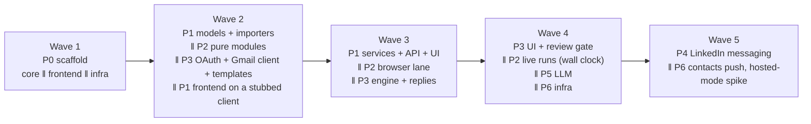

# netkeeper implementation guide

| | |
|---|---|
| Status | Draft v0.1 |
| Date | 2026-09-20 |
| Feeds | The GitHub issue backlog. One work item here becomes one issue |
| Depends on | [architecture.md](architecture.md) for the design, [networking-workflow.md](networking-workflow.md) for the vision, [adr/](adr/) for the decisions |

## 1. How to use this guide

Each work item has an ID `P<phase>-<nn>`, a goal, what it depends on, which lane it belongs to, a size, and a "done when" that becomes the issue's acceptance criteria. Create one issue per item with the title `[P1-04] Generic CSV importer` and the labels in the table below. Phases are milestones. Checkpoints (`CP<n>`) are issues too, labeled `checkpoint`, and a milestone does not close until its checkpoint issue does.

| Label | Values |
|---|---|
| `phase:` | `0` to `6` |
| `area:` | `core`, `extractor`, `crm`, `campaigns`, `llm`, `frontend`, `infra`, `docs` |
| `lane:` | `core`, `extractor`, `campaigns`, `frontend`, `infra` (section 2) |
| `size:` | `S` (up to half a day), `M` (one to two days), `L` (three to five days). Sizes assume AI-assisted development |
| `checkpoint` | Human review gate; blocks the milestone |
| `safety` | Touches budgets, pacing, browser identity, send caps, or secrets. Needs a second look |

Global definition of done, applied to every item:

- Tests run offline and pass; browser-touching items also pass the opt-in smoke suite on a real Chrome.
- Every list endpoint registers with the two-user isolation test (from P0-09 onward).
- No captured LinkedIn data, tokens, or real contact details in the diff.
- `CHANGELOG.md` has an entry under Unreleased when behavior changed.
- The spec is updated if the item changed a documented decision, and an ADR exists if it reversed one.

## 2. Lanes and parallelism

Five lanes can run concurrently, each in its own worktree and branch, merging to `main` through pull requests. The lanes are chosen so that their code rarely touches the same files.

| Lane | Owns | Rarely touches |
|---|---|---|
| `core` | `models/`, `db.py`, `crm/`, `services/`, `web/api/` for CRM resources | Browser code, Gmail code |
| `extractor` | `linkedin/`, the runs and budget API, `rehearse`, `simulate`, smoke tests | Campaign engine, CRM UI |
| `campaigns` | `campaigns/`, `mailbox`, templates, the campaign API | Browser code (until phase 4) |
| `frontend` | `frontend/` | Backend, except regenerating the client |
| `infra` | CI, Dockerfile, launchd, backups, docs | Application code |

### Waves

The dependency graph collapses into five waves. Inside a wave, items run in parallel; a wave starts when the items it depends on have merged.



What makes the waves possible:

- **P2 and P3 do not depend on each other.** The extractor writes contacts; the campaign engine reads them. Both depend only on P1-01 (contact models) and P1-06 (the filter compiler, for audiences). Start both as soon as those two merge.
- **Pure modules first.** Pacing, budget, heat, classification (P2-04, P2-05, P2-03) and template rendering and lint (P3-03) have no I/O. They can be written and fully tested in wave 2 while the models are still settling.
- **The frontend can start on a stubbed client.** P0-06 sets up client generation from the OpenAPI schema. P1 frontend items begin against a hand-written schema stub for contacts and switch to the generated client when P1-05 merges.
- **Wall clock is a dependency.** CP4 needs a week of scheduled extractor runs and CP7 needs two weeks for a follow-up step to fire. Start the extractor's live runs (wave 4) before the campaign UI is finished, so the calendar time overlaps with build time.

### Merge order inside a wave

When two lanes touch the same model, `core` merges first. Migrations are linear; a lane that needs a schema change opens a small `core` pull request for the migration and rebases on it, rather than carrying the migration in a feature branch for a week.

### Critical path

P0-03 → P0-09 → P1-01 → P1-02 → P1-06 → P3-04 → P3-06 → P3-07 → P3-08 → P3-09 → CP6 → CP7 (two weeks of calendar) → P4-03 → CP8. Everything else has slack. If only one lane can run, run this one and pull P2 items into gaps.

## 3. Human checkpoints

Checkpoints exist because the risks in this project are not "does the code work" but "did it drift from the vision" and "did a safety default get loosened for convenience". Each checkpoint names what to look at, what questions to answer, and what to re-read. A checkpoint that fails produces issues, not a longer checkpoint.

Drift signals to watch for at every checkpoint:

- A feature that does not map to a row in the spec's [workflow mapping table](architecture.md#3-mapping-to-the-reference-workflow).
- A default that moved toward more throughput (a bigger budget, a shorter delay, auto-send on, a fallback browser mode).
- A screen that needs a manual. The reference workflow fits on one page; so should each screen.
- A general-CRM shape creeping in: companies as objects, deals, pipelines, custom fields.
- A `linkedin/` module that imports from `models/`.
- A list endpoint without an isolation test.

| Checkpoint | Closes | What you review |
|---|---|---|
| CP0 | Phase 0 | The scaffold runs end to end; the user boundary is real |
| CP1 | Mid phase 1 | Data model and filter language, before UI is built on them |
| CP2 | Phase 1 | Your own archive imported, triaged, exported |
| CP2.5 | CP2's feedback | The same demo again, with buttons, automation, and a way back |
| CP3 | Mid phase 2 | Pacing, budgets, classification, posture, before the first live run |
| CP4 | Phase 2 | One week of scheduled runs against your real account |
| CP5 | Mid phase 3 | Gmail OAuth setup by following the guide cold |
| CP6 | Mid phase 3 | A ten-contact campaign in draft mode |
| CP7 | Phase 3 | The first real batch, reviewed after the follow-up step fires |
| CP8 | Phase 4 | A supervised LinkedIn prefill and inbox detection |
| CP9 | Phase 5 | Quality of twenty LLM personal lines |
| CP10 | Phase 6 | Release readiness and the multi-user decision |

### CP0: scaffold review

- **Demo:** `netkeeper serve` on a clean checkout; the dashboard renders; `make test` and CI are green; `netkeeper db upgrade` from empty.
- **Questions:** Does every API route go through `CurrentUser`? Does the two-user test harness exist even though it has nothing to test yet? Is the frontend client generated, not hand-written? Are secrets in Keychain, never in the data directory?
- **Re-read:** spec section 5 (process model, multi-user readiness), section 14.2.

### CP1: data model and filter language

- **Demo:** Migrations for `user`, `contact` and children, `tag`, `list`, `import_run`; the filter DSL compiling ten representative filters; identity resolution on a fixture with all five match paths.
- **Questions:** Can every row in the mapping table be answered by this model? Is `preferred_name` there? Is provenance per field, not per row? Does every unique constraint include `user_id`? Does the migration test pass on PostgreSQL?
- **Re-read:** spec section 8, section 10.4.
- **Why now:** Phase 1 frontend and both phase 2 and phase 3 build on these tables. A change after CP1 costs three lanes.

### CP2: import, triage, export on real data

- **Demo:** Import your own LinkedIn archive; triage 50 contacts with the keyboard; build a "Validated, has email" smart list; export nine-column CSV; import a LinkedHelper CSV and resolve the candidates.
- **Questions:** Did triage feel faster than the spreadsheet? Did the evidence panel help decide? Did anything get created as a duplicate? Is the export usable by a mailing tool as-is?
- **Re-read:** workflow stages 1 and 2; the non-goals.
- **Outcome:** Phase 1 alone already replaces two stages. If it does not feel like a win here, stop and fix before building the extractor UI on the same components.

### CP2.5: the triage pass, after the first real use

- **Demo:** Import the archive from the downloaded zip with no terminal and no extraction; read what was tagged and decided automatically; triage the rest with the mouse as well as the keyboard, going back when you change your mind; build a static list and export it.
- **Questions:** Is it clear where you are, both in the setup and in the queue? Does the automatic pass leave enough judgement to be worth reviewing, and not so much that it decided for you? Does employer overlap change a decision that the address-book count alone did not? Would you finish the 616?
- **Re-read:** workflow stages 1 and 2; spec 10.2.
- **Why now:** CP2 produced feedback rather than a sign-off. This is the same demo with that feedback built in.

### CP3: extractor safety review, before the first live run

- **Demo:** `netkeeper preflight` against your Chrome; `netkeeper rehearse` against the neutral site with the request log; `netkeeper simulate --days 14 --throttles 2` showing budgets, warm-up, heat; `netkeeper posture` with every protection on (the Settings page that shows the same report arrives with P2-12); the browser smoke suite passing on your Chrome (`NETKEEPER_BROWSER_TESTS=1`).
- **Questions:** Are the defaults in Appendix C what the code does? Is there any path that launches a browser? Does a checkpoint response stop the run with no retry? Does the budget stop between profiles, never mid-profile? Does `linkedin/` import nothing from `models/`?
- **Re-read:** ADR 0002, spec sections 9.5 to 9.7, 9.10.
- **Outcome:** a safety review only. Nothing here contacts LinkedIn beyond logging in to the netkeeper Chrome profile. The first supervised live run moved to CP4 (CP3 decision), because it needs connections sync (P2-06), which is not one of this checkpoint's items.

### CP4: a week of scheduled runs

- **First:** one supervised live incremental sync with `profile_visits_per_day = 5`, watching the tab. Before it, confirm only one browser client per account across processes (#153). The capture #149 asked for is done: it showed the connections list moved to `flagship-web`, and P2-17 (#187) reads it from what the page loads. During this run, check the three things the capture could not: which answer ends the list (P2-17 reads an empty answer, or a short one that asks for no next page), whether the first screen's total counts anyone the list never shows (then no full sync completes, and nobody ages), and whether the page answers a wall in place of the document. Enrichment reads profiles the same way since P2-18 (#190), with one Contact info click per visit: during `netkeeper linkedin enrich --max-visits 5`, check the rows the shape note marks assumed (where the profile's own id sits, the document form of a profile, the Contact info control's `href`, how a missing profile answers, education and the phone, birthday, and address sections), and whether the profile's headline agrees with the connections card's (#149 item 5). Moved here from CP3. Scheduled runs ship disarmed (P2-10), so this run is by hand: `netkeeper linkedin sync` (incremental), then `netkeeper linkedin enrich --max-visits 5`. Arm scheduled runs with `netkeeper linkedin schedule arm` only after it.
- **Demo:** Runs page for the week: every run, its counts, budget spend per day, heat history, any `Throttled` or `Checkpoint`.
- **Questions:** Any throttle at all? If so, on which endpoint, and did the probes pass? Did the warm-up ramp as designed? Did contacts you pinned get enriched first? Did any contact get a wrong email (spot-check ten against the overlay by hand)?
- **Re-read:** spec section 9.8, the igtracker lesson about 429s that are not rate limits.
- **Outcome:** Only after this do scheduled runs get the production defaults.

### CP5: Gmail setup by following the guide

- **Demo:** Someone (you, on a clean Google account, or a second person) creates the Cloud project and OAuth client from the setup guide alone, authorizes, and sees the mailbox healthy in Settings (connected, with when its token was last refreshed).
- **Questions:** How long did it take? Where did the guide lose you? Did the unverified-app screen surprise you? Does re-auth after a revoked token work?
- **Re-read:** ADR 0003.
- **Why now:** Setup friction is the biggest adoption risk for contributors and other users; measure it before the campaign UI hides it.

### CP6: ten-contact draft campaign

- **Demo:** A campaign with the default sequence, enrolled from a smart list, in `draft` mode; review gate with previews; test send; activation; ten drafts appearing in Gmail with labels; send two by hand and watch the tool record `sent`; reply to one from another account and watch the enrollment go `replied`.
- **Questions:** Would you send these drafts as written? Did lint catch a body without merge fields? Is the excluded-contacts summary correct and understandable? Does the follow-up preview thread under the first email?
- **Re-read:** spec sections 11.1, 11.8, 11.9.

### CP7: first real batch, after the follow-up

- **Demo:** The first batch of up to 100 in `send` mode; two weeks later, the campaign page: sends per day, replies per step, bounces, opted out, the inbox page.
- **Questions:** Response rate against the benchmarks in the workflow doc? Any follow-up sent to someone who had replied (the one failure that must not happen)? Any send before the campaign's scheduled start? Any send outside your sending hours other than the first batch on its start day? Did Gmail push back in any way? What did you do by hand that the tool should have done?
- **Re-read:** workflow stages 3 to 5, the benchmarks table.
- **Outcome:** This is the checkpoint that proves the product. Take a full pass over the backlog afterward.

### CP8: supervised LinkedIn prefill

- **Demo:** One `prefill` step on a real contact, with you watching Chrome; send it by hand; the next inbox poll marks it `sent`; a reply moves the enrollment.
- **Questions:** Did the typing look human? Was the right conversation opened? Is auto-send still off and highlighted on the posture page?
- **Re-read:** ADR 0004.

### CP9: LLM output quality

- **Demo:** Twenty generated personal lines across a mix of contacts, shown next to what you would have written.
- **Questions:** How many would you send unchanged? Did any invent a fact? Is the cost estimate before a bulk run accurate?
- **Re-read:** spec section 12.

### CP10: release readiness and the multi-user decision

- **Demo:** Clean install from the README on a second Mac; container build on Linux; backup and restore; the hosted-mode spike (P6-06) as a short written result.
- **Questions:** Is v0.1.0 the local single-user product the spec describes, with nothing half-built? What does the spike say about self-hosted versus hosted, and does it change any readiness constraint? What is the next ADR?
- **Re-read:** the whole spec, one more time, against the shipped behavior.

## 4. Work items

### Phase 0: scaffold

**P0-01 Python project tooling** · lane core · S
Goal: `pyproject.toml` with the `netkeeper` package and console script, `uv.lock`, `ruff`, `mypy`, `pytest` config, a `Makefile` with `dev`, `test`, `lint`, `serve`, `build-ui`.
Depends on: nothing.
Done when: `uv venv && uv pip install -e '.[dev]'` works on a clean clone; `make lint test` passes with one placeholder test.

**P0-02 Configuration, paths, logging** · lane core · S
Goal: TOML `Settings` with the resolution order in spec section 15; data-dir resolution per platform; structured logging with `NETKEEPER_LOG_LEVEL` and a bad value that logs and falls back.
Depends on: P0-01.
Done when: `netkeeper config show` prints the resolved settings and paths; tests cover each resolution step.

**P0-03 Database core and first migration** · lane core · M
Goal: engine with WAL, `session_scope()`, `UTCDateTime`, Alembic wired, the `user` table, the migration-diff test, `netkeeper db upgrade`.
Depends on: P0-02.
Done when: a fresh database migrates from empty; the diff test passes; the `user` row is created at first start.

**P0-04 FastAPI application factory** · lane core · M
Goal: app factory with lifespan, `/api/v1/health`, `/api/v1/me`, the CSRF guard (header plus same-origin), the SSE event bus, the task runner skeleton with a single in-process queue, static mount for the frontend build.
Depends on: P0-03.
Done when: a POST without the header is refused; SSE delivers a test event; a route that enqueues a task returns `202` and the task's events arrive.

**P0-05 CLI skeleton** · lane core · S
Goal: Typer app with `serve`, `db upgrade`, `config show`, `backup`, `version`.
Depends on: P0-04.
Done when: each command runs; `--help` is accurate.

**P0-06 Frontend shell and client generation** · lane frontend · M
Goal: Vite, React, TypeScript, TanStack Router and Query, Tailwind, shadcn/ui; a layout with the navigation from spec 14.3; `openapi-typescript` generation from the exported schema; dev proxy to the backend; a dashboard page that calls `/health` and `/me`.
Depends on: P0-01 (for the repo), P0-04 for the schema (use a stub until it merges).
Done when: `pnpm dev` shows the layout with live health; `pnpm build` output is served by the backend; a schema change regenerates the client.

**P0-07 CI** · lane infra · S
Goal: GitHub Actions on push and pull request: Python lint, types, tests; frontend lint, `tsc`, `vitest`; client-generation diff check; a PostgreSQL service container ready for P1-17.
Depends on: P0-01, P0-06.
Done when: CI is green on `main` and a deliberate client drift fails it.

**P0-08 launchd agent script** · lane infra · S
Goal: `scripts/install-launchd.sh` installing a user agent for `netkeeper serve`, with logs under the data directory.
Depends on: P0-05.
Done when: `serve` starts at login and restarts after a kill.

**P0-09 Auth provider and scoping helper** · lane core · M · `safety`
Goal: `AuthProvider` interface, `LocalSingleUser`, `CurrentUser` dependency, a `scoped(session, user)` query helper, the two-user isolation test harness that discovers registered list endpoints.
Depends on: P0-04.
Done when: `/me` returns the local user; the harness runs with zero registered endpoints; a lint rule or test fails any query against a user-owned table that bypasses the helper.

**CP0** · checkpoint · closes phase 0.

### Phase 1: import and CRM

**P1-01 Contact models and migrations** · lane core · M
Goal: `contact`, `contact_email`, `contact_phone`, `contact_link`, `contact_position`, `contact_snapshot`, `contact_alias`, `interaction`, per spec 8.1, all with `user_id` and portable types.
Depends on: P0-03, P0-09.
Done when: migrations pass the diff test on SQLite and PostgreSQL; a factory fixture creates contacts with children.

**P1-02 Identity resolution and merge** · lane core · M
Goal: the five-step resolution in spec 8.2, alias tracking, and `merge(contact_a, contact_b)` that re-points children and records `merged_into_id`.
Depends on: P1-01.
Done when: fixtures cover each path, including the candidate path; merge is transactional and idempotent.

**P1-03 LinkedIn archive importer** · lane core · M
Goal: read the archive zip or individual CSVs; skip the preamble lines; import `Connections.csv` with provenance `archive`; import `messages.csv` and `Invitations.csv` as interactions and triage evidence.
Depends on: P1-02, P1-18.
Done when: a sanitized sample archive imports with correct counts; re-import is idempotent; email is only set where present.

**P1-04 Generic CSV importer with mapping and review** · lane core · L
Goal: upload, mapping (by header name, saved as a preset), preview of the first 20 resolutions, candidate review decisions, commit in one transaction, `import_run` and `import_row` provenance, field-level precedence rules from spec 10.5. Presets: `linkedin-archive`, `linkedhelper`, `nine-column`.
Depends on: P1-02.
Done when: the LinkedHelper sample imports and enriches existing contacts without overwriting manual fields; a rollback by run id removes only what that run created.

**P1-05 Contacts API** · lane core · M
Goal: list with filter, sort, pagination, and column selection; get with children and timeline; patch; bulk actions on a filter with a count confirmation token; archive.
Depends on: P1-01, P1-06, P1-18.
Done when: OpenAPI is complete; the isolation test covers list and bulk; 10,000 contacts list in under 300 ms; a field edit sticks and can be reverted to the synced value.

**P1-06 Filter language and compiler** · lane core · M
Goal: the filter tree from spec 10.4 as Pydantic models, compiled to SQLAlchemy, with every predicate listed there.
Depends on: P1-01.
Done when: each predicate has a test; invalid trees produce a readable error; the compiler is reused by lists, campaigns, and exports.

**P1-07 Tags and auto-tag rules** · lane core · M
Goal: tags with kinds, rule engine over title, headline, and company, default rule set, suppression rows, run on create, enrichment, and demand; a "matches N" preview.
Depends on: P1-01.
Done when: default rules tag a fixture set as expected; removing an auto-tag suppresses it on the next run; manual tags are untouched.
As built: on demand shipped here; P1-22 added the import, over the contacts it wrote (#64). A contact created by hand, and the enrichment the extractor brings in phase 2, still wait for a run.

**P1-08 Lists and saved views** · lane core · S
Goal: static lists with membership, smart lists holding a filter, saved table views.
Depends on: P1-06.
Done when: a smart list's members equal the filter's result; "Validated" ships as a built-in.

**P1-09 Triage service and API** · lane core · M
Goal: next-untriaged with evidence (message threads, interactions, shared companies, notes), decide, undo, preferred-name edit, the bulk suggestion "mark everyone with message history as met".
Depends on: P1-03, P1-01.
Done when: the API supports a keyboard flow without round trips for evidence; undo restores the previous state exactly.

**P1-10 Interactions and notes** · lane core · S
Goal: interaction CRUD, `last_contacted` derived query, notes as Markdown.
Depends on: P1-01.
Done when: the timeline endpoint returns interactions and snapshots interleaved by time.

**P1-11 Exporters** · lane core · M
Goal: CSV, JSON, vCard 4.0; presets `nine-column` (with `headerless`), `linkedin-archive`, `full`, `campaign-audience`; exports respect a filter and strip internal counters.
Depends on: P1-06.
Done when: the nine-column export round-trips through the nine-column import unchanged.

**P1-12 Frontend: contacts table and detail** · lane frontend · L
Goal: table with server-side filter, sort, pagination, column picker, saved views, row and bulk actions; detail page with fields, children, tags, timeline, snapshots.
Depends on: P0-06; P1-05 for the real client.
Done when: every action in spec 10.1 exists; the table stays responsive at 10,000 rows.

**P1-13 Frontend: import wizard** · lane frontend · M
Goal: upload, preset or manual mapping, preview, candidate review, commit, per-run history with rollback.
Depends on: P1-04.
Done when: CP2's import demo runs without touching the CLI.

**P1-14 Frontend: triage screen** · lane frontend · M
Goal: one contact at a time, evidence panel, the keyboard map from spec 10.2, progress, filters, bulk suggestion banner.
Depends on: P1-09.
Done when: fifty contacts can be triaged in under ten minutes with the keyboard alone.

**P1-15 Frontend: tags, rules, lists, filter builder, exports** · lane frontend · L
Goal: tag management with rule editor and live match count; list pages; a visual filter builder that produces the filter tree; export dialog with presets.
Depends on: P1-06, P1-07, P1-08, P1-11.
Done when: every predicate in the filter language is reachable from the builder.

**P1-16 CLI: import, export, triage stats** · lane core · S
Goal: `netkeeper import archive|csv`, `netkeeper export`, `netkeeper contacts stats`.
Depends on: P1-03, P1-04, P1-11.
Done when: each command mirrors its API counterpart.

**P1-17 PostgreSQL in CI for migrations** · lane infra · S
Goal: run the migration diff test against the service container from P0-07.
Depends on: P0-07, P1-01.
Done when: a deliberately SQLite-only construct fails CI.

**P1-18 Manual overrides stick, with revert to the synced value** · lane core · S
Goal: CP1 decision. A manual edit of a LinkedIn field outranks every later source until the user reverts it. Every non-manual observation of a provenance field is recorded in `contacts.synced_values` (JSON, field → value, source, observed_at) whether or not it was written to the live column, so the "last synced value" is always available. `revert_to_synced(contact, field)` restores that value and its provenance; `set_manual_field` records the override. Migration 0003 adds the column.
Depends on: P1-02.
Done when: a sync after a manual edit leaves the edit in place and updates `synced_values`; revert restores the synced value and clears the override; the provenance matrix tests cover manual-then-sync, sync-then-manual, revert, and a field never synced (revert refused).

**P1-19 Merge carries tags and suppressions** · lane core · S
Goal: `identity.merge()` re-points `contact_tags` and `contact_tag_suppressions` from the loser to the survivor, deduplicating by tag with `tag_contact`'s precedence (manual beats rule and llm; on a tie keep the survivor's row), so a merged-away contact's tags do not silently vanish.
Depends on: P1-02, P1-07.
Done when: merging two tagged contacts yields the union of their tags on the survivor with the right sources, suppressions carry over, and the loser has no assignments left.

**P1-20 Archive import through the API** · lane core · M
Goal: `POST /api/v1/imports/archive` takes the LinkedIn export zip itself — upload, unpack, reuse `crm.archive.import_archive`, answer with the per-file counts (connections, messages, invitations, positions, files ignored). Guards for size, member count, compression ratio, and path traversal. A directory path stays available to the CLI.
Depends on: P1-03, P1-04.
Done when: the real archive imports through the API with the counts the CLI reports, a second run adds nothing, and a zip that is not a LinkedIn export answers 422 naming the file it expected.

**P1-21 Frontend: import the archive, and how to get one** · lane frontend · M
Goal: the wizard takes the downloaded zip with no extraction step; it recognises an archive, a LinkedIn CSV, and a generic CSV, and says which it found; a panel explains how to request the export from LinkedIn, that it arrives by email in 1 to 24 hours, and which file to pick when doing it by hand; the result says what each file contributed.
Depends on: P1-20.
Done when: CP2.5's import runs from the downloaded zip without a terminal, an extraction, or a guess about which CSV to choose.

**P1-22 Triage starts from what netkeeper already decided** · lane core · M
Goal: auto-tag rules run on the contacts an import touched, inside the same writer transaction, with the counts in the run summary (#64). The suggestion catalogue grows past the single message-history batch — an invitation with a note, a tag a rule applied, no evidence at all — each with a preview of who it covers, a count checked before it applies, and one batch id undo takes back. A queue filter serves the contacts whose latest decision was automatic, so the manual pass reviews that work instead of starting cold.
Depends on: P1-07, P1-09.
Done when: importing the real archive tags contacts with no button press, every offered batch can be previewed before it applies, and the queue can serve exactly the contacts a batch decided.
Since: the "no evidence at all" batch was removed by CP2.5's feedback (#142). Triage is an affirmative pass, so nothing decides `not_met` from an absence; the tag batches, which may decide either way, are the user's own declared rule and stayed.

**P1-23 Frontend: triage controls, position, and going back** · lane frontend · M
Goal: every action in the keymap gets an on-screen button labelled with its key; the card shows its position in the queue and what is left; the queue is visible and a contact in it can be opened; a person can walk back through cards they already passed, see the decision each carries, and change it — separate from undo, which stays "take back the last write". Carries the #92 fixes.
Depends on: P1-14.
Done when: fifty contacts can be triaged with the mouse alone as well as the keyboard alone, the position is always on screen, and stepping back one contact changes nothing until a decision is made.

**P1-24 Frontend: the dashboard says where you are** · lane frontend · S
Goal: the scaffold cards give way to the setup path — import your data, review what was tagged, triage, build a list, export — each step with its real count, its state, and the control that advances it. Later phases add their own steps (LinkedIn, Gmail) to the same list.
Depends on: P1-25.
Done when: someone opening netkeeper for the first time is told what to do next without reading this guide, and every number on the page comes from the API.

**P1-25 Contact stats endpoint, and the import drafts nobody can see** · lane core · S
Goal: `GET /api/v1/contacts/stats` over `contact_stats()`, with a parity test against the CLI and the triage progress counters; a way to list and remove orphaned draft import runs, and a resume by run id so a refused commit is finished rather than re-read (#90).
Depends on: P1-05, P1-16.
Done when: the CLI, the dashboard, and the triage screen take their counts from one place, and three dry runs leave nothing behind that cannot be seen or removed.

**P1-26 Your own positions, and the overlap that comes from them** · lane core · M
Goal: `Positions.csv` in the archive fills a table of the user's own job history, editable by hand; the triage card carries genuine you-and-them overlap with its date range, named apart from the address-book count, which stays (#84). Message bodies are stored as plain text rather than raw HTML fragments (#75).
Depends on: P1-03, P1-09.
Done when: a contact who worked where you worked says so with the years, the address-book count keeps its own name, and no stored summary contains a tag LinkedIn's editor emits (text inside an unrecognized tag is kept verbatim, brackets and all, rather than deleted for looking tag-shaped — losing what somebody wrote is the worse failure, and every renderer escapes this field regardless).

**P1-27 The list_member predicate, its 500, and merge** · lane core · M
Goal: `list_member` compiles — a subquery over `list_members` for a static list, the stored tree inlined for a smart one, with a visited-set guard so two lists cannot reference each other forever; `GET /exports` turns an unavailable predicate into a 422 before the first chunk (#95); `identity.merge` re-points `list_members`, and `ListMember` joins `CONTACT_CHILDREN` (#81).
Depends on: P1-08.
Done when: a static list exports its own members, an unavailable predicate is never a 500 or a truncated 200, and merging keeps the survivor in every list the loser belonged to.

**P1-28 Frontend: the automatic pass, and exporting a static list** · lane frontend · S
Goal: triage opens on what was decided automatically — what the rules tagged during the import, which batches are on offer, who each covers, and a review queue of the decisions already applied; `/lists` gains the Export button P1-27 makes truthful, and the filter builder gains the list picker that makes `list_member` reachable, which P1-15 promised for every predicate.
Depends on: P1-22, P1-23, P1-27.
Done when: the first thing a person sees after an import is the work already done for them, a static list exports its members rather than everyone, and every predicate in the filter language is reachable from the builder.

**CP1** · checkpoint · after P1-01, P1-02, P1-06 merge.
**CP2** · checkpoint · closes phase 1.
**CP2.5** · checkpoint · closes CP2's feedback.

### Phase 2: LinkedIn extractor

**P2-01 Browser attach provider** · lane extractor · L · `safety`
Goal: `BrowserProvider` with only `attach`; connect over CDP, reuse `contexts[0]`, one tab per run, `_ensure_page`, one reattach per run, `BrowserUnavailable`; the activity lock keyed by `linkedin_account`; `netkeeper browser launch` and `netkeeper preflight`.
Depends on: P0-04, P0-09.
Done when: the smoke suite verifies attach, headers, tab recovery, and that no code path launches a browser; preflight reports login state and fingerprint.

**P2-02 Voyager module and fixtures** · lane extractor · L
Goal: header builder, in-page fetch helper, endpoint constants with capture dates, parsers for connections pages, contact info, profile details, and conversations; a documented procedure for capturing and sanitizing fixtures.
Depends on: nothing for parsers (fixtures); P2-01 for the fetch helper.
Done when: every parser has fixture tests; an unknown shape raises `RouteChanged`, never a `KeyError`.

**P2-03 Response classification** · lane extractor · M · `safety`
Goal: `classify(response, url, body)` returning the six outcomes in spec 9.7; the session flag in `settings_kv`; no retry on `Checkpoint`.
Depends on: nothing (pure).
Done when: a table-driven test covers every row of the classification table, including 429 with an HTML body and 200 with a login page.

**P2-04 Pacing** · lane extractor · M · `safety`
Goal: `human_delay`, `scroll_like_a_person` plan generator, bursts, active hours with midnight wrap, warm-up ramp, weekend multiplier; all pure.
Depends on: nothing.
Done when: seeded statistical tests bound the distributions; the plan generator is deterministic per seed.

**P2-05 Budgets and heat** · lane extractor · M · `safety`
Goal: per-day and per-week counters by action class in `settings_kv` keyed by LinkedIn account; enforcement between units; heat score with decay on read, cooldown multiplier, skip threshold, manual clear.
Depends on: P0-03.
Done when: budget math is tested across the local-day boundary; heat decays as configured; overshoot by one unit is the maximum.

**P2-06 Connections sync** · lane extractor · L
Goal: `SyncJobSpec` in, `ConnectionsPage` out; full and incremental modes; `crm/apply.py` applying the edge lifecycle from spec 9.8 inside a session (under `crm/`, not `linkedin/`: a module under `linkedin/` that opens a session would break spec 9.10's boundary); `linkedin_account` model.
Depends on: P2-01, P2-02, P2-05, P1-02.
Done when: fixture-driven full sync creates and updates contacts; incremental stops at the first known page; two misses set `li_disconnected_at`; a reappearance clears it.

**P2-07 Enrichment** · lane extractor · L · `safety`
Goal: `EnrichJobSpec` in, `ProfileHarvest` out; profile visit, scroll, harvest everything, snapshots on change, prioritization from spec 9.6, pins (max 5), cancel between profiles, resume from a stored plan.
Depends on: P2-06, P2-04.
Done when: a rehearsal run against the neutral site shows the request pattern; a fixture harvest updates children without downgrading known values to null; resume skips completed contacts.

**P2-08 DOM fallbacks** · lane extractor · M
Goal: connections-page scroll enumeration and contact-info overlay parsing, used when the API path reports `RouteChanged`.
Depends on: P2-01.
Done when: smoke tests against a local HTML replica pass; the fallback is selected automatically.

**P2-09 Scheduler** · lane extractor · M
Goal: APScheduler jobs for incremental sync, weekly full sync, enrichment, inbox poll; next-fire persistence; active-hours deferral; catch-up after downtime (once, 5 to 20 minutes after start); reschedule only on change; jobs carry `user_id` and `linkedin_account_id`.
Depends on: P2-06, P2-07, P2-04.
Done when: `simulate` reproduces a daily schedule across restarts without a skipped or doubled run.

**P2-10 Runs, progress, and API** · lane extractor · M
Goal: `sync_run` recording, progress to SSE, runs list and detail, start and cancel, budget and heat status, pins API.
Depends on: P2-06, P2-07, P0-04.
Done when: the UI can start a run, watch it, and stop it; the isolation test covers runs.

**P2-11 Rehearse, simulate, posture** · lane extractor · M
Goal: `netkeeper rehearse` against a neutral site with a page-level request log; `netkeeper simulate` with virtual clock and injected throttles; `services/posture.py` summarizing every protection with warnings for anything off.
Depends on: P2-04, P2-05, P2-09.
Done when: CP3's demo can be run from these three commands.

**P2-12 Frontend: LinkedIn page** · lane frontend · M
Goal: browser status and launch instructions, preflight results, runs with live progress and stop, budget and heat panels, pins, session banner.
Depends on: P2-10.
Done when: everything on the page updates over SSE without reload.

**P2-13 Browser smoke suite** · lane extractor · M
Goal: `NETKEEPER_BROWSER_TESTS=1` suite: attach, headers and client hints, scroll events observed, tab close and recovery, no launch.
Depends on: P2-01.
Done when: it passes on Chrome stable on macOS and is documented in CONTRIBUTING.

**P2-14 Extractor boundary enforcement** · lane extractor · S · `safety`
Goal: an import-linter test that fails if anything under `linkedin/` imports `models` or `db`; the job spec and result dataclasses from spec 9.10 as the only interface.
Depends on: P2-06.
Done when: the test exists and passes; `crm/apply.py` is the only module that maps extractor results onto rows.

**P2-15 Prior campaign history import** · lane core · M · `safety`
Deferred to phase 3 (maintainer, 2026-09-23): the opens and clicks shape is decided with the campaign schema (P3-05) rather than ahead of it. It no longer gates CP4. Issue #65.
Goal: import the outreach history from the previous mailing tool so netkeeper knows who was already contacted before it sends anything. The export is one `.xlsx` workbook, one tab per campaign, laid out as a report rather than a table: a campaign summary row, then side-by-side blocks of openers, clickers, and bounced addresses at column offsets that differ between tabs. Match recipients through `crm/identity.py` on email address, write one `email_out` interaction per recipient per campaign dated from the campaign start so `last_contacted_at` becomes correct, mark bounced addresses so the phase 3 enrollment guard in F18 has something to read, and decide where opens and clicks live alongside the phase 3 campaign tables rather than ahead of them. The source records delivery only: replies, positive responses, and unsubscribes are not in it and come from the phase 3 Gmail reply detection run backwards over the historical threads. Do not infer a decline from a non-open.
Depends on: P1-03, P1-04, P1-10. Decide the opens and clicks shape with P3-05.
Done when: the import is idempotent, unmatched addresses are reported rather than dropped, bounces show on the contact, and the fixtures are hand-built and sanitized. Real exports stay in `~/code/netkeeper-private`, never in the repo.

**P2-16 Request the archive for the user** · lane extractor · M · `safety`
Deferred (maintainer, 2026-09-23): manual archive import already works, and automating a LinkedIn settings flow waits until scheduled runs have a clean record. It no longer gates CP4 and has no milestone. Issue #120.
Goal: netkeeper asks LinkedIn for the data export in the attached session, then waits — the export takes 1 to 24 hours and arrives as a notification. The run records which step it is on, the dashboard shows it, and when the file is ready netkeeper downloads and imports it. Manual mode stays first-class — request it yourself, download it yourself, drop the zip in — and one status list covers both.
Depends on: P2-01, P1-20.
Done when: both modes reach an imported archive from the same screen, the automated one survives a restart mid-wait, and a changed LinkedIn page stops the run with `RouteChanged` rather than a guess.

**P2-17 Read what the page loads** · lane extractor · L · `safety`
Goal: the connections sync reads the answers LinkedIn's own connections page loads as it is scrolled, instead of requesting anything itself ([ADR 0006](adr/0006-observe-dont-request.md)). The #149 capture showed the list moved from Voyager to `flagship-web`. Delivers the observation seam (`BrowserRun.observe`), the flight parser, the connections parser and source, sanitized fixtures and a shape note for connections, profiles, and contact info (`docs/linkedin-flagship-web-shapes.md`). Issue #187.
Depends on: P2-01, P2-06, #149's capture.
Done when: an offline fixture-driven sync creates contacts with the URN from `vieweeProfileId`, the slug, name, headline, and connected-on date; incremental mode stops at the first page of known URNs; an empty page ends the list and completeness is honest for aging; a changed payload stops the run with `RouteChanged` and writes no partial data; the smoke suite drives the seam against a loopback replica; no test or tool touches linkedin.com.
Next: P2-18.

**P2-18 Enrichment reads what the page loads** · lane extractor · L · `safety`
Goal: enrichment reads each profile from the answers its page loads, and its contact info from the overlay's answer after ADR 0006's one click on **Contact info**, a narrow `BrowserRun` method. The in-page Voyager fetch is retired. Delivers `linkedin/flagship_profile.py` (parsers), `linkedin/page_profiles.py` (the source), `BrowserRun.click_contact_info`, the rehearsal on the new pattern, and the shape note's enrichment table. Issue #190.
Depends on: P2-17.
Done when: a fixture-driven harvest produces a `ProfileHarvest` with the URN, headline, location, positions, and contact info and never downgrades a known value to null; the click happens at most once per visit, only on the Contact info control, paced and budgeted; a changed shape gives `RouteChanged` or an unreadable profile, never wrong-person data, and the page's URN must match the contact's; the smoke suite drives the click and the observation against a loopback replica; `fetch.py` is removed.

**CP3** · checkpoint · after P2-01 to P2-05, P2-11.
**CP4** · checkpoint · closes phase 2, after one week of scheduled runs. P2-15 and P2-16 are deferred and are not part of it.

### Phase 3: email campaigns

**P3-01 Mailbox and Gmail OAuth** · lane campaigns · M · `safety`
Goal: `mailbox` model; installed-app OAuth flow from the Settings page and CLI; token in Keychain under the user's key; `invalid_grant` detection sets `reauth_required` and pauses email steps; the setup guide for the Cloud project.
Depends on: P0-09.
Done when: CP5 can be attempted from the guide; a revoked token produces the banner within one poll.

**P3-02 Gmail client wrapper and fake** · lane campaigns · M
Goal: a thin client over `googleapiclient` covering drafts, send, threads, labels, history, messages search; a fake with the same interface for tests; purpose logging per call.
Depends on: P3-01.
Done when: every engine test runs against the fake; one opt-in test runs against a real account.

**P3-03 Templates, rendering, lint** · lane campaigns · M
Goal: `template` model with versioning; sandboxed Jinja with the merge fields from spec 11.1 and the `ago` filter; lint rules (undefined variables, no per-contact field, missing subject, bad links).
Depends on: P1-01.
Done when: lint blocks activation on errors; rendering a contact with missing fields produces a lint warning, not an exception.

**P3-04 Campaign models** · lane campaigns · M
Goal: `campaign`, `campaign_step`, `enrollment`, `message` per spec 8.5, with `user_id`.
Depends on: P1-01.
Done when: migrations pass on both databases.

**P3-05 Guards** · lane campaigns · S · `safety`
Goal: the eligibility checks in spec 11.9, run at enrollment and at every step fire, producing a per-contact reason.
Depends on: P3-04, P1-10.
Done when: each guard has a test; the excluded summary text is generated from the reasons.

**P3-06 Engine and scheduler tick** · lane campaigns · L · `safety`
Goal: the state machine from spec 11.3, the minute tick, send windows, holidays, per-mailbox and per-campaign caps, spacing with jitter, persistence of the next fire, pause and resume.
Depends on: P3-04, P3-05, P3-03, P1-06.
Done when: `simulate` runs a 100-contact sequence over three weeks with no send outside a window or over a cap, and step 2 timing derives from actual `sent_at`. (#338 later replaced the send window with a scheduled start and suggested send slots: spec 11.4.)

**P3-07 Send and draft modes** · lane campaigns · M
Goal: RFC 2822 building, `send` and `draft` modes, in-thread follow-ups, campaign labels, draft-to-sent detection, discarded drafts.
Depends on: P3-06, P3-02.
Done when: the fake shows correct headers for a follow-up; a draft that disappears with a SENT message in the thread becomes `sent`.

**P3-08 Reply and bounce detection** · lane campaigns · L · `safety`
Goal: history-based polling with threads fallback, from-address search for out-of-thread replies, bounce detection, unsubscribe phrases, inbound message storage and interactions.
Depends on: P3-07.
Done when: a reply moves the enrollment to `replied` before the next step fires in `simulate`; the follow-up never fires for a replied enrollment.

**P3-09 Review gate and test send** · lane campaigns · M · `safety`
Goal: the activation requirements in spec 11.8: sampled previews, searched previews, test send per email step, lint clean, guard summary acknowledged. (Since #339, one approval per step replaces the sampled and searched previews.)
Depends on: P3-06, P3-07.
Done when: activation is impossible through the API without every requirement recorded.

**P3-10 Frontend: templates** · lane frontend · M
Goal: editor with lint results, live preview against a chosen contact, version history.
Depends on: P3-03.
Done when: a lint error is visible before save.

**P3-11 Frontend: campaigns and inbox** · lane frontend · L
Goal: campaign list, builder with steps, audience from list or filter with the excluded summary, review gate flow, progress per step, enrollment table, inbox page for detected replies with mark-handled and add-note.
Depends on: P3-09, P3-08.
Done when: CP6's demo runs entirely in the UI.

**P3-12 Dashboard** · lane frontend · M
Goal: next fires, budget and heat, mailbox and browser health, replies this week, changed-jobs prompts.
Depends on: P3-06, P2-10.
Done when: the page answers "what happens next and is anything unhealthy" in one glance.

**P3-13 CLI: campaigns** · lane campaigns · S
Goal: list, activate, pause, status, `simulate` extension for campaign schedules.
Depends on: P3-06.
Done when: each command mirrors the API.

**CP5** · checkpoint · after P3-01.
**CP6** · checkpoint · after P3-09 and P3-11.
**CP7** · checkpoint · closes phase 3, two weeks after the first real batch.

### Phase 4: LinkedIn messaging

**P4-01 Inbox poll** · lane extractor · M
Goal: `InboxJobSpec` in, `InboxDelta` out; conversation parsing from fixtures; participant matching by URN; apply as interactions.
Depends on: P2-02, P2-06.
Done when: fixtures produce the expected deltas; unknown participants are ignored, not created.

**P4-02 LinkedIn reply detection** · lane campaigns · S
Goal: `campaigns/replies.py` consumes `InboxDelta` and moves enrollments to `replied`.
Depends on: P4-01, P3-08.
Done when: a LinkedIn reply suppresses a pending email step in `simulate`.

**P4-03 Prefill step** · lane extractor · L · `safety`
Goal: `MessageJobSpec` with `prefill`; open the conversation, type with human timing, stop; `prefilled` state; send confirmation by the inbox poll; `stale` after three days; one open prefill at a time.
Depends on: P2-01, P2-07, P3-06, P4-01.
Done when: the smoke suite verifies typing against a local replica; the engine reconciles `prefilled` to `sent` or `stale`.

**P4-04 Auto-send opt-in** · lane extractor · M · `safety`
Goal: config flag plus per-step mode; `li_messages_auto` budget; active hours and heat applied; posture highlight; documentation of the risk.
Depends on: P4-03.
Done when: with the flag off, no code path clicks Send; with it on, the budget stops it.

**P4-05 Frontend: LinkedIn steps** · lane frontend · M
Goal: step builder supports the LinkedIn channel; the waiting-for-you list; posture highlight for auto-send.
Depends on: P4-03.
Done when: CP8's demo runs in the UI.

**CP8** · checkpoint · closes phase 4.

### Phase 5: LLM module

**P5-01 Client, key storage, cost controls** · lane campaigns · M
Goal: Anthropic client with the configured models, key in Keychain, per-day call cap, token estimate before bulk runs, prompt caching for system prompts.
Depends on: P0-09.
Done when: the module is inert without a key; the cap stops a bulk run.

**P5-02 Personal line** · lane campaigns · M
Goal: `{{ personal_line }}` generated at preview time from contact data and your notes, stored with the message, editable in the review gate.
Depends on: P5-01, P3-09.
Done when: a campaign using the field cannot activate until every message of a step using it was approved on its own (the review gate already requires this since #339).

**P5-03 Title classification** · lane crm · S
Goal: LLM tags with confidence, applied above a threshold as `kind = llm`, suggested below it.
Depends on: P5-01, P1-07.
Done when: suppression works for LLM tags as for auto-tags.

**P5-04 Call prep and triage suggestion** · lane crm · M
Goal: on-demand brief on the contact page; a suggested triage decision with a reason in the evidence panel, never applied automatically.
Depends on: P5-01, P1-09.
Done when: both appear only when the module is enabled.

**P5-05 Frontend: LLM settings and surfaces** · lane frontend · S
Goal: key entry, model choice, cap, cost estimate dialog, the surfaces above.
Depends on: P5-02 to P5-04.
Done when: CP9's demo runs in the UI.

**CP9** · checkpoint · closes phase 5.

### Phase 6: polish and reach

**P6-01 Google Contacts push** · lane campaigns · M
Goal: `contacts` scope added to the OAuth client; one-way push with groups per tag under a prefix; `people_resource_name` stored; never deletes.
Depends on: P3-01, P1-07.
Done when: a re-push updates rather than duplicates.

**P6-02 vCard groups and macOS import guide** · lane crm · S
Goal: vCard export with a group per tag; a short guide for importing into Contacts.
Depends on: P1-11.
Done when: the export imports cleanly into macOS Contacts.

**P6-03 Container image and compose** · lane infra · M
Goal: multi-stage Dockerfile, compose with host networking and an explicit `--host`, the Linux setup guide, the "why not on macOS" note.
Depends on: P0-06, P0-05.
Done when: the image builds in CI and serves the UI on a Linux host.

**P6-04 Backups UI and restore** · lane core · S
Goal: nightly backup job, retention, `netkeeper restore`, a Settings panel listing backups.
Depends on: P0-05.
Done when: a restore from backup yields a database that passes the migration diff.

**P6-05 User documentation** · lane infra · M
Goal: setup guides for Chrome, Gmail OAuth, first import, first campaign; a troubleshooting page built from the classification table and the posture warnings.
Depends on: everything above.
Done when: CP10's clean-install demo needs no help beyond the docs.

**P6-06 Hosted-mode ADR and spike** · lane core · M
Goal: a written spike answering open question 6: what a `netkeeper agent` split, a second auth provider, and a PostgreSQL deployment would each take, given the readiness constraints; a proposed ADR, not an implementation.
Depends on: P2-14, P0-09, P1-17.
Done when: the ADR is proposed with an estimate for each path and a recommendation.

**P6-07 Release v0.1.0** · lane infra · S
Goal: version, changelog, tag, GitHub release with the install steps.
Depends on: CP10.
Done when: the release page is the README's install path.

**CP10** · checkpoint · closes phase 6.

## 5. Seeding the backlog

Create the milestones first (`Phase 0` to `Phase 6`), then the labels, then one issue per item, with checkpoints last so they can reference the item numbers. A script that reads this file and calls `gh issue create` is a reasonable P0 side task; until then, the pattern is:

```sh
gh issue create --title "[P1-04] Generic CSV importer with mapping and review" \
  --milestone "Phase 1" \
  --label "phase:1,area:crm,lane:core,size:L" \
  --body-file - <<'BODY'
**Goal:** upload, mapping (by header name, saved as a preset), preview of the first 20 resolutions, ...

**Depends on:** #<P1-02 issue number>

**Done when:** the LinkedHelper sample imports and enriches existing contacts without overwriting manual fields; a rollback by run id removes only what that run created.

Spec: docs/architecture.md section 10.5
BODY
```

Keep the item ID in the title. It is how this guide, the issues, and pull requests refer to the same thing.

## 6. Revising this guide

When a checkpoint changes the plan, edit the affected items here and in their issues in the same pull request, so the guide stays the source of the backlog rather than a snapshot of it. Items are never renumbered; a dropped item is marked "dropped, see #issue" and a new one takes the next number in its phase.
